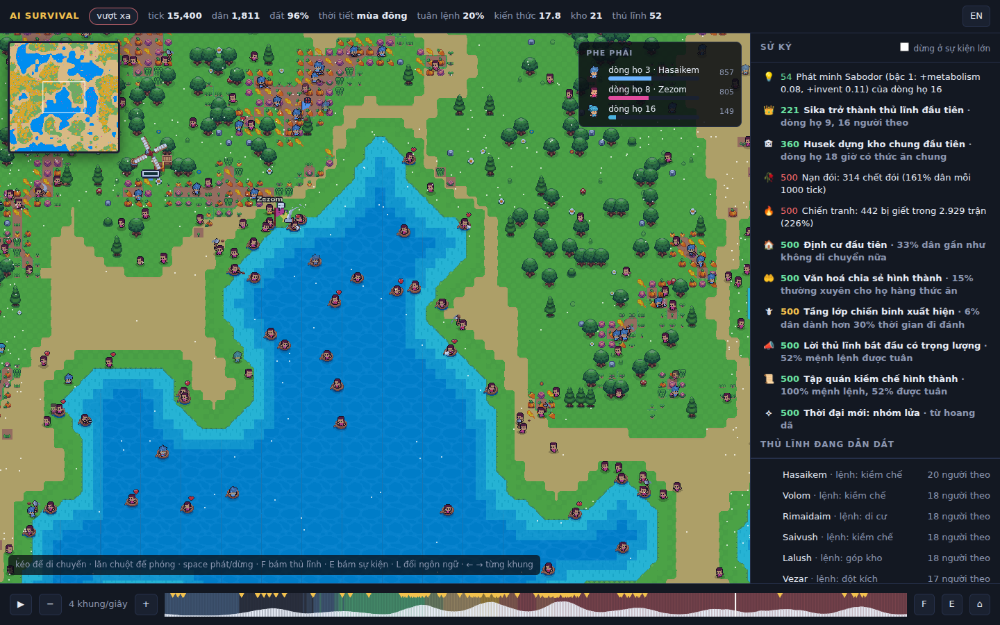
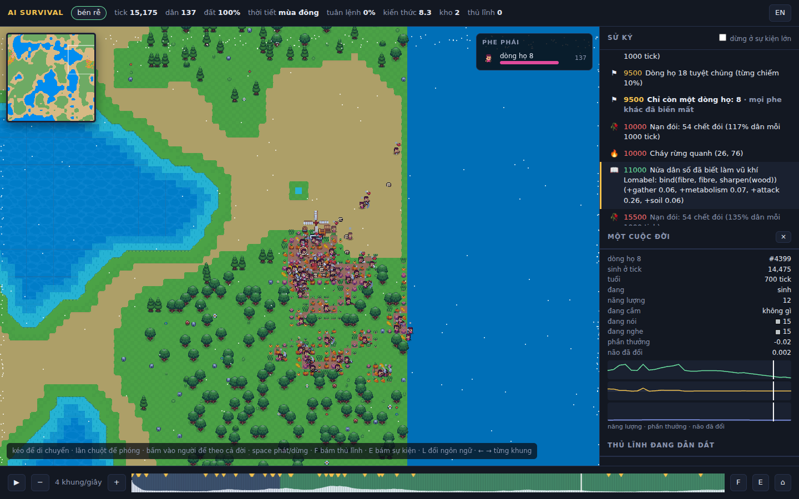

# AI Survival

Một thí nghiệm về sự sống nhân tạo. Thả hàng nghìn agent có não riêng vào một thế giới có luật vật lý
nhưng không có kịch bản, rồi xem chúng tìm ra cách sống nào: hái lượm, định cư, cướp bóc, chia sẻ,
đi theo thủ lĩnh, phát minh, hay khai thác đất tới cạn kiệt rồi diệt vong.

Không có gì bắt buộc phải giống lịch sử loài người. Thế giới có thể tuyệt chủng, sụp đổ, trì trệ,
hoặc thịnh vượng. Mỗi thế giới tự sinh ra công nghệ của riêng nó. Điều duy nhất được kiểm tra là:
xã hội có tìm được cách giữ mọi thứ phát triển mà không tự huỷ diệt hay không.

Repo này hiện chứa **lõi mô phỏng headless** (`sim/`). Chưa có đồ hoạ engine,
chỉ có xuất ảnh PPM, CSV, sử ký, và bảng kết cục khi chạy nhiều thế giới.

## Xem bằng mắt





```bash
cd sim && ./target/release/sim --seed 3 --ticks 20000 --snapshot-every 25 --out ../viewer/out
python3 ../viewer/serve.py            # rồi mở http://127.0.0.1:8765/index.html?seed=3
# thêm &live=1 để xem trong lúc sim đang chạy
# Dữ liệu cho trình xem KHÔNG nằm trong git: vừa clone về thì phải chạy dòng trên trước.
# Sim tất định: cùng seed cùng cờ thì ra đúng một thế giới, chạy lại bao nhiêu lần cũng thế.
# Muốn thế giới khác thì đổi --seed, hoặc dùng --seed random (seed được in ra để chạy lại).
# Số seed trên URL phải trùng số seed đã chạy, nếu không trang sẽ báo không có dữ liệu.
```

`viewer/index.html` là game viewer 2D pixel art chạy trong trình duyệt bằng **PixiJS** (WebGL, đã kèm sẵn
trong `viewer/lib`, không cần mạng). Viewer có hai bộ hình:

- **Sunnyside World** (Daniel Diggle, bán trên itch.io) là bộ chính. Đây là pack trả phí, không được phân
  phối lại, nên **không có file nào của nó trong repo**. Mua pack rồi chạy một lệnh, viewer tự nhận:

  ```bash
  pip install pillow
  python3 tools/import_sunnyside.py ~/Downloads/Sunnyside_World_ASSET_PACK_V2.1.zip
  # ghi vào viewer/assets/sunnyside (đã có trong .gitignore), nhận cả zip lẫn thư mục đã giải nén
  ```

  Script cắt 14 hoạt ảnh nhân vật (mỗi khung 80x48, tám lớp: thân, sáu kiểu tóc, dụng cụ, màu đã chuẩn hoá
  để đổi màu chính xác), chép tileset 16px, đóng gói cây, mùa màng, gia súc, lửa, khói, biểu cảm, thanh
  máu, khung 9-slice, và cắt sáu ngôi nhà mái xanh, đỏ, cam, tím, lam cùng sáu cụm mây ngay từ bản đồ mẫu
  của pack. Cối xay gió 9 khung tách riêng.
- **Generic RPG Pack** của Bakudas và Gabe Fern, giấy phép CC0, nằm trong `viewer/assets/rpg` kèm
  `CREDITS.md`, là bộ dự phòng khi chưa có Sunnyside (hoặc thêm `&rpg=1` vào địa chỉ để ép dùng).

Với Sunnyside, cách vẽ như sau:

- **Bản đồ**: biển sâu là khối sóng của pack trôi chậm, nước nông sáng dần vào bờ, ô nước sát đất dùng bộ
  autotile sông nên bờ uốn và bo góc chéo. Cỏ có sáu biến thể, bãi cát là bộ autotile cát phủ trên cỏ, ruộng
  là các thửa đất canh tác có lối cỏ xen giữa, trên thửa mọc lúa mì, cà rốt, bí, bắp cải, khoai, củ dền, súp
  lơ, cải xoăn theo ba giai đoạn canh tác. Cây to hai loại theo độ màu mỡ, bụi, hoa, nấm, đá rải trên đất
  hoang. Mỗi bộ autotile 15 tile của pack trả lời cùng một bảng mặt nạ 8 hướng (đủ, bốn cạnh, bốn góc trong,
  bốn góc ngoài chéo), viewer suy ra tile từ mặt nạ và tự chọn tile gần nhất cho hình dạng pack không có.
- **Thuyền**: ai đang trên biển ngồi trong thuyền thúng của pack (4 khung nhấp nhô), bóng dưới chân tắt đi.
- **Một cuộc đời**: bấm vào một người trên bản đồ để theo cả đời. Bảng bên phải hiện dòng họ, tên, tick sinh
  và chết, tuổi, việc đang làm và lệnh đang chịu, năng lượng, đồ đang cầm, ký hiệu đang nói và đang nghe,
  phần thưởng tick vừa rồi, và độ trôi của não so với lúc sinh; ba đường nhỏ vẽ năng lượng, phần thưởng và
  độ trôi não suốt đời, vạch trắng là thời điểm đang xem. Camera bám theo người đó; Esc để thôi.
- **Tiếng gọi**: phóng đủ gần, trên đầu mỗi người có một ô màu là tín hiệu đang phát (16 màu cho 16 ký hiệu;
  cùng màu là cùng tiếng gọi) và một chấm trắng nếu tick vừa rồi có lời. Nhìn một làng cùng màu là nhìn
  một quy ước đang hình thành.
- **Bầy thú** là bò, cừu, lợn của pack đứng thành cụm, cụm càng đông bầy càng lớn; bầy đang bị đánh có
  biểu tượng tấn công trên đầu. Sử ký ghi cuộc săn chung đầu tiên như một sự kiện lớn.
- **Nơi trú** vẽ từ lớp nhà cửa của snapshot, đúng ô người ta dựng: nhà mái xanh cho khung gỗ, mái đỏ và cam
  cho đá, đất sét, xương, mái tím và lam cho thứ đã nung; nhà chắc (sức trú từ 0,7) vẽ to hơn, nhà nung chắc
  có lửa trại bên cạnh. **Đồ vật** hiện khi phóng đủ gần: rìu cho công cụ, kiếm cho vũ khí, giỏ cho bình
  chứa, ngọn lửa cho ai đang giữ lửa. Sử ký ghi từng công thức ("buộc(mài(đá), gỗ, sợi) → công cụ") và
  lần đầu mỗi loại đồ vật xuất hiện trong thế giới.
- **Nhân vật** 80x48 với hoạt ảnh thật của pack: chạy khi di chuyển, vung kiếm khi tấn công, cuốc đất khi
  thu hoạch, khuân đồ khi chia sẻ, ôm nhau khi sinh sản, ôm bụng khi đói, ngã xuống và hoá thành đầu lâu
  khi chết (tối đa 300 hoạt ảnh chết cùng lúc). Tóc, áo và quần yếm cùng nhuộm màu phe (kiểu tóc theo dòng họ), dưới chân là
  vòng bóng màu phe nên nhìn từ xa vẫn biết ai thuộc dòng họ nào; người ốm ngả xanh. Mọi khung của mọi dòng họ nằm trong một texture 4096x2048 nên hàng chục
  nghìn sprite vẫn vẽ trong một lần gọi.
- **Làng** đông có nhà của pack (mái xanh, đỏ, cam, tím, lam theo vị trí), làng rất đông có thêm lửa trại
  cháy và gà, bò, lợn, cừu, vịt đi lại. **Kho chung** là cối xay gió quay, thùng, rương, thanh xanh mức đầy.
- **Thủ lĩnh** đội vương miện, cắm cờ hiệu màu phe to theo số người theo, kèm tên và bong bóng biểu cảm của
  pack cho lệnh đang ra (cảnh giác, mũi tên, tấn công, căng thẳng, trò chuyện). Người đang sinh sản có
  bong bóng trái tim khi phóng đủ gần.
- **Mây** trôi qua bản đồ kèm bóng mây trên mặt đất. Banner sự kiện lớn dùng khung 9-slice của pack.

Với bộ CC0 dự phòng: đất hồng cam của pack thành cát, áo nhân vật thành màu phe, tán cây thành xanh và vàng
thu, phủ trắng mùa đông; nước, bờ cát, cây trồng, cờ hiệu, vương miện, nhát chém vẽ bằng code theo bảng màu
của pack; nhân vật là Gabe và Mani 24x24 với 7 khung chạy.

- **Minimap** góc trái với địa hình và chấm phe, bấm để bay tới. Tông màu đổi theo mùa và hạn hán, tuyết rơi
  mùa đông. Bản đồ chia 16 mảnh, chỉ mảnh có ô đổi mới được vẽ lại.
- **Phe phái** là dòng họ. Mỗi dòng họ có màu áo riêng từ bảng 24 màu, kiểu tóc (Sunnyside) hoặc hoạ tiết
  áo (CC0) riêng, nên phân biệt được cả khi mù màu. Bảng phe phái bên phải hiện thị phần, thủ lĩnh và sprite mẫu, bấm để bay tới.
- **Sử ký song ngữ Việt Anh**, phím L để đổi. Sim ghi loại sự kiện, viewer dịch theo loại và có biểu tượng.
- **Sự kiện lớn** (đổi thời đại, thủ lĩnh đầu tiên, đại thủ lĩnh, dịch bệnh, kho đầu tiên, tập quán, sụp đổ,
  tuyệt chủng, đất chết, chiến binh, định cư, chia sẻ) hiện banner giữa màn hình và camera bay tới, có tuỳ chọn
  tự dừng. Chúng cũng được đánh dấu tam giác vàng trên thanh thời gian.
- Thanh thời gian tô màu thời đại và vẽ dân số. Phím F bám thủ lĩnh lớn nhất, E bám sự kiện, space phát,
  mũi tên đi từng khung, kéo thả ba file để xem không cần server.

Định dạng khung bản 8 ghi ở đầu `sim/src/snapshot.rs`: mặt nạ biển một lần ở đầu file, bốn lớp lượng tử hoá (thức ăn,
canh tác, độ màu mỡ, nhà cửa), mã hoá delta và RLE với khung
khoá mỗi 16 khung, agent 27 byte có id để nội suy, đồ vật đang cầm, tín hiệu nói và nghe, phần thưởng, độ trôi não. 20.000 tick chụp mỗi 25 tick, đỉnh 4.000 agent, nặng 70 MB,
trong đó đất chỉ vài KB mỗi khung. Sim flush sau mỗi khung, `serve.py` hỗ trợ Range, nên `&live=1` bám được
run đang chạy.

### Chạy trên máy cá nhân

Đo trên máy ảo 4 nhân, không GPU: sim đạt khoảng 700.000 agent-tick mỗi giây, tức một thế giới 4.000 agent
chạy 175 tick mỗi giây, 20.000 tick trong 80 giây. Kết quả giống hệt từng byte dù bao nhiêu luồng. Viewer
vẽ vài nghìn sprite hoạt ảnh bằng WebGL, chạy tốt trên GPU tích hợp; ở đây kiểm tra bằng Chromium không đầu
với GL phần mềm (16 khung hình mỗi giây với 2.200 nhân vật hoạt ảnh và bản đồ 256x256 khi không có GPU,
bộ nhớ JS 115 MB). Tôi chưa chạy trên máy của bạn, nên hai điều cần xem: RAM của trình duyệt bằng cỡ file
ảnh chụp cộng vài chục MB, và với run trên 50.000 tick nên chụp thưa hơn hoặc xem trực tiếp.

## Chạy thử

```bash
cd sim
cargo build --release
./target/release/sim --seed 3 --ticks 30000 --image-every 5000   # một thế giới, xem trực tiếp
./target/release/sim --seed random --ticks 20000                  # một thế giới bất kỳ; seed được in ra để chạy lại
./target/release/sim --seeds 1-16 --ticks 30000                  # 16 thế giới song song, bảng kết cục
./target/release/sim --help
```

Một run kết thúc sớm nếu tuyệt chủng. Kết cục được phân loại: `extinct`, `collapsed` (dân số cuối dưới
một phần tư giai đoạn tốt nhất), `boom and bust` (dao động trên bốn lần ở cuối run), `fallen` (tụt thời đại),
`surviving`, `flourishing`, và biến thể `on dying land` khi đất đã cạn quá nửa.

Không phụ thuộc crate ngoài. Phần cảm nhận và tiếp xúc chạy song song trên mọi nhân bằng
`--threads N`, chia agent thành khối cố định 256 với RNG riêng từng khối, nên kết quả giống hệt
từng byte dù chạy bao nhiêu luồng. Một thế giới 20.000 tick với đỉnh 5.500 agent mất khoảng 50 giây
trên 4 nhân. Không còn trần dân số: đất là giới hạn duy nhất (`--max-agents 0`, mặc định).

Kết quả ghi vào `out/`:

- `stats_seed<N>.csv`: dân số, số dòng họ, Gini, số sinh, chết đói, bị giết, tấn công, chia sẻ, phân bố hành động, entropy chiến lược, theo từng cửa sổ thời gian.
- `frame_<tick>.ppm`: bản đồ. Xanh dương là biển, xanh lá là thức ăn, đỏ là ruộng đang canh tác, chấm màu là agent với màu do gen quy định, trắng là đang ốm.
- `events_seed<N>.txt`: sử ký. Phát minh, dòng họ thống trị hoặc tuyệt chủng, nạn đói, chiến tranh, dịch bệnh, thiên tai, tầng lớp mới, thủ lĩnh, đổi thời đại, sụp đổ, đất cạn kiệt, tuyệt chủng.
- `experiment_A_B.csv`: bảng kết cục khi chạy `--seeds A-B`.

Cùng seed luôn cho cùng kết quả, nên có thể replay và so sánh thí nghiệm.

## Cách thế giới vận hành

**Thế giới** là lưới ô cuộn tròn. Mỗi ô có độ màu mỡ tiềm năng, sinh ra từ value noise
rồi ngưỡng hoá để đất tốt tụ thành từng vùng và khoảng 40% bản đồ gần như cằn cỗi. Phần trũng nhất của
noise là **biển**: không ai đứng, đi hay sinh ra trên đó; ai đi tới bờ thì trượt dọc bờ hoặc dừng lại, nên
đất liền chia thành các lục địa và hồ, và du mục không thể băng thẳng qua nước, cho tới khi họ có
**thuyền**. Thuyền không có sẵn: nó là một chiều phát minh (`sea`), ai cộng dồn đủ 0,25 thì đi được trên
nước. Trên nước tiêu hao năng lượng gấp 1,6 lần, không sinh con được, nhưng hái được cá: 60% tốc độ hái
trên đất, nhân với năng lực đi biển, và biển không bao giờ cạn. Ai đang ở trên biển mà kiến thức đi biển bị
quên (thế hệ mới không kịp học) thì chìm dần. Sử ký ghi chuyến ra khơi đầu tiên của mỗi thế giới. Các kết
quả thí nghiệm ghi bên dưới được đo trước khi có biển và thuyền, trừ mục "Sau khi có biển". Thức ăn mọc lại theo độ màu mỡ và theo mùa. Mùa đông giảm tốc độ mọc
xuống 20%.

**Bầy thú** (tắt mặc định, bật bằng `--herd-density 3.5`). Trên đất màu mỡ có vài bầy thú lớn đi ăn cỏ, lớn dần lại sau khi bị săn.
Một bầy chỉ ngã khi **ít nhất hai người** đánh nó gần như cùng lúc với tổng sức đủ lớn (đòn đánh cộng dồn
nhưng phai một nửa mỗi tick); một người đánh lẻ tốn công và có thể làm bầy bỏ chạy. Thịt chia đều cho những
ai đã đánh, xương rơi tại chỗ, bầy biến mất 1.500 tick rồi hiện lại nơi khác. Đây là việc duy nhất trong thế
giới mà một người không làm nổi một mình, đặt ra để xem tiếng gọi có tìm được nghĩa khi có thứ cần phối
hợp. Não thấy bầy gần nhất: có hay không, hướng, còn bao nhiêu thịt. Thí nghiệm 16 seed (docs/lab/herds.md) cho
thấy bầy thú làm định cư tụt từ 68% xuống 15% mà gần như không ai săn được chung, nên mặc định tắt.

**Đất có thể chết.** Mỗi đơn vị thức ăn hái đi bào mòn độ màu mỡ một chút. Đất được nghỉ, còn nhiều
thức ăn, thì hồi phục chậm về tiềm năng. Đất cạn hẳn hồi phục cực chậm. Phát minh làm hái nhanh hơn
thường cũng làm đất mòn nhanh hơn. Đây là thứ để mất: xã hội thành công quá nhanh có thể tự huỷ diệt.

**Agent** có năng lượng, kho dự trữ, tuổi, dòng họ, kiến thức, và một bộ gen. Gen gồm trọng số
của một mạng thần kinh hồi quy 97 input, 20 ẩn, 24 output (2.464 tham số), 9 gen tính khí, 4 gen học, cộng một
"màu" ba chiều; thêm 480 synapse dẻo học trong đời, không di truyền.
Nhận diện họ hàng dựa trên khoảng cách màu.

**Mỗi tick**, agent nhìn thấy: năng lượng, tuổi, kho, thức ăn tại chỗ và gradient thức ăn,
agent gần nhất (hướng, khoảng cách, độ họ hàng, chênh lệch sức mạnh, kho của nó),
số hàng xóm là họ hàng và không họ hàng, mùa, mình vừa bị đánh hay chưa, mình biết công nghệ gì,
ô đang đứng có phải ruộng không, cảm xúc, ký ức, nhà, bệnh, thủ lĩnh và lệnh, kho gần nhất, vùng đất
quanh đây, và **biển**: bờ cách bao xa về bốn hướng (trong tầm 4 ô) và vùng mình đứng có bao nhiêu phần
là nước. Không có phát minh đi biển; não chỉ học nơi đất kết thúc.
Não trả về hướng di chuyển, một cổng đi hay ở, và một trong sáu hành động:

| Hành động | Tác dụng |
|---|---|
| gather | Lấy thức ăn từ ô đang đứng, dư thì cất vào kho |
| attack | Đánh agent gần nhất trong tầm. Ai khoẻ hơn dễ thắng. Thắng thì cướp kho và gây sát thương |
| share | Cho họ hàng gần nhất một phần kho, và một đơn vị vật liệu mình dư mà họ thiếu |
| repro | Nếu đủ năng lượng, sinh con. Con thừa hưởng gen có đột biến |
| rest | Giảm tiêu hao năng lượng |
| craft | Làm một thứ đã biết từ vật liệu trong tay, hoặc thử ghép, mài, khoét, đập, nung xem ra gì |

Không có hàm thưởng. Ai sinh được nhiều con thì gen của họ tồn tại. Đó là toàn bộ thuật toán học.
Diệt vong là thật: khi agent cuối cùng chết, run kết thúc. Cờ `--min-pop N` bật lại "nhập cư" nếu muốn.

## Cái gì có não, cái gì là luật

Mỗi agent có một bộ não riêng: mạng thần kinh hồi quy 97 input, 20 ẩn, 24 output, 2.464 trọng số,
kèm 9 gen tính khí và 4 gen học. Mọi quyết định mỗi tick (đi đâu, ở hay đi, hái, đánh, chia sẻ, sinh, nghỉ,
chế tác, ghi gì vào bộ nhớ, ra lệnh gì, nói gì) đều do não này đưa ra. Không có kịch bản hành vi nào.

Não thay đổi theo ba cách, ở ba thang thời gian:

- **Tiến hoá** giữa các đời: con thừa hưởng trọng số bố mẹ có đột biến; chọn lọc tự nhiên giữ lại não sống được.
- **Bắt chước** trong đời: kéo trọng số của mình về phía một họ hàng giàu hơn hẳn.
- **Học trong đời** (mới): lớp ẩn→ra có phần dẻo, thay đổi mỗi tick theo luật Hebb có điều biến: thay đổi
  synapse = tốc độ × phần thưởng × (a·trước·sau + b·trước + c·sau), trong đó phần thưởng là thay đổi tài sản
  (năng lượng cộng kho) của tick vừa rồi, còn tốc độ và a, b, c là **gen**. Một dòng họ có thể tiến hoá ra
  tốc độ học gần 0 (não cứng) hoặc cao (não mềm). Phần dẻo sinh ra trắng, không di truyền. Não cũng thấy
  phần thưởng tick trước như một đầu vào.

Não còn **nói**: mỗi tick phát ra một tín hiệu hai chiều trong [-1, 1]. Nói tốn năng lượng theo độ lớn tín
hiệu (mặc định 0,02 mỗi đơn vị, so với tiêu hao nền 0,15), nên nói dối hay nói suông đều có giá. Đầu vào
là trung bình tín hiệu của họ hàng trong tầm nhìn, của người lạ, và tín hiệu của người gần nhất; người lạ
nghe được theo `--hear-strangers` (mặc định 1; đặt 0 là chỉ họ hàng nghe rõ, phòng thí nghiệm cho thấy
thế giới nghèo đi hẳn). Tín hiệu không có nghĩa định sẵn. Sim đo entropy của những gì được nói và hai
**thông tin tương hỗ** (đã hiệu chỉnh thiên lệch mẫu nhỏ): `signal_meaning`, giữa điều một người nói và
tình trạng của chính họ (tiếng gọi có nội dung), và `signal_mi`, giữa tín hiệu nghe được từ người gần nhất
và hành động ngay sau đó (tiếng gọi được hiểu). Khi cả hai vượt 0,2 bit ở một xã hội từ 300 người, sử ký
ghi "tiếng gọi bắt đầu có nghĩa". Đó là dấu hiệu sớm nhất của ngôn ngữ, và là một câu hỏi nghiên cứu mở của
repo này.

Não có **hai cách học trong đời**, chọn bằng cờ. Mặc định là luật Hebb có điều biến: nối hoạt động
đang diễn ra với phần thưởng đang tới. `--gradient` bật cách thứ hai, actor-critic có vết đủ điều
kiện: não tự nuôi một **nhà phê bình** định giá hiện tại, học từ khoảng cách giữa điều xảy ra và
điều nó tưởng, và giữ một vết mờ dần về các lựa chọn gần đây nên phần thưởng đến muộn vẫn tìm được
việc đã sinh ra nó. Não ấy phải chọn việc theo xác suất chứ không lấy điểm cao nhất, vì việc không
thử thì không dạy được gì. `--know-rate` mở kênh thứ ba: người bắt chước lấy luôn một phần **cái
người kia đã học được**, không chỉ cái họ được sinh ra cùng. Cách đọc từng mảnh, vì sao bước học
phải tự chuẩn hoá, và kết quả đo được nằm trong docs/HOC-MAY.md.

Phần viết tay là **luật thế giới**: thức ăn mọc thế nào, đánh nhau tính thắng thua ra sao, công nghệ
có tác dụng gì, thiên tai xảy ra thế nào, cảm xúc tăng giảm theo sự kiện nào. Đó là "harness". Não phải
tự tìm cách sống trong luật đó. Nông nghiệp, định cư, tầng lớp chiến binh, thủ lĩnh, chia sẻ, và giờ là
rìu, thuyền, lửa, nồi, tường đều là thứ não tìm ra, không phải thứ được lập trình. Với đồ vật, phần viết
tay là **vật lý của vật liệu** (mục Vật liệu và cách gia công), không phải danh sách phát minh.

## Cảm xúc, suy nghĩ, may mắn

**Cảm xúc**: sợ, giận, vui, gắn bó, mỗi loại trong [0, 1]. Bị đánh thì sợ và giận, được chia sẻ thì vui và
gắn bó, no đủ thì vui, đói thì giận. Tốc độ nguôi và độ nhạy của từng cảm xúc là gen, nên tính khí tiến hoá.
Cảm xúc là input cho não và có tác dụng cơ học: sợ làm đánh yếu đi, giận làm đánh đau hơn, vui làm
dễ phát minh, gắn bó làm chia sẻ và dạy học nhiều hơn. Người theo thủ lĩnh bị lây cảm xúc của thủ lĩnh.

**Suy nghĩ**: bốn ô nhớ hồi quy não tự ghi mỗi tick và đọc lại tick sau, cộng trí nhớ về nhà là ruộng
đầu tiên mình canh tác.

**May mắn**: vận may cá nhân (tìm được kho), tai nạn, và mỗi năm thế giới đổ xúc xắc:
hạn hán, năm được mùa, mùa đông khắc nghiệt, dịch bệnh, lũ lụt, cháy rừng, vùng trù phú.
Dịch bệnh lây theo tiếp xúc, ăn nặng nhất ở làng đông người, miễn dịch sau khi khỏi rồi phai dần.

## Nhìn xa hơn ô đang đứng

Agent chỉ thấy ô dưới chân thì không thể phân biệt một mảnh đất mệt với một vùng đang chết, nên không
bao giờ rời đi kịp. Vì vậy thế giới có thêm **bản đồ vùng**: chia bản đồ thành ô vuông 12x12, mỗi 50 tick
tính lại độ khoẻ đất, lượng thức ăn và mật độ dân của từng vùng, rồi tính hướng tới vùng hứa hẹn nhất
trong 8 vùng lân cận. Não nhận sáu input: đất vùng này, thức ăn vùng này, mật độ vùng này, hướng x,
hướng y tới vùng tốt hơn, và mức chênh lệch. Chi phí gần như bằng không vì tính một lần cho cả thế giới.

## Mệnh lệnh của thủ lĩnh

Mỗi bộ não đều sinh ra một mệnh lệnh mỗi tick, nhưng nó chỉ tới tai ai đó nếu người này đang là thủ lĩnh.
Mệnh lệnh tới người theo chậm một tick, đúng như tin tức cần thời gian lan.

| Mệnh lệnh | Coi là tuân lệnh khi | Phần thưởng khi tuân |
|---|---|---|
| hold | đứng yên | chăm ruộng hiệu quả gấp 1,5 |
| move | đi cùng hướng được chỉ | chi phí di chuyển giảm 30% |
| raid | hành động là tấn công | sức đánh cộng thêm 12 |
| conserve | không hái lượm | nếu nghỉ thì tiêu hao giảm một nửa |
| pool | hành động là chia sẻ | cho đi nhiều hơn 1,5 lần |

**Không ai bị ép tuân lệnh.** Cùng một bộ não vừa chọn hành động vừa quyết định có theo lệnh hay không,
và nó nhìn thấy lệnh đó dưới dạng input. Tuân lệnh làm tăng gắn bó, cãi lệnh làm giảm gắn bó và làm
thủ lĩnh mất uy tín. Vì vậy thủ lĩnh ra lệnh sai sẽ mất người theo. Tỉ lệ tuân lệnh của cả xã hội là một
chỉ số được đo, và khi một loại lệnh chiếm quá nửa với tỉ lệ tuân trên 40% thì sử ký ghi nhận một **tập quán**
đã hình thành, ví dụ "tập quán ở lại" hay "tập quán kiềm chế".

## Tập quán: lệnh sống lâu hơn người ra lệnh

Một mệnh lệnh được tuân đi tuân lại sẽ thành **tập quán** của người tuân: agent giữ nó trong đầu với một
độ bền, và khi không có thủ lĩnh nào trong tầm nhìn thì tập quán lên tiếng thay, với đúng các phần thưởng
của mệnh lệnh đó. Tập quán lan giữa họ hàng như meme, người giữ chắc truyền cho người giữ lỏng. Cãi lại
tập quán của chính mình làm nó mòn, và nó phai dần theo thời gian nếu không được củng cố. Vì vậy một
xã hội có thể giữ thói quen kiềm chế hay ở lại sau khi thủ lĩnh đã chết. Sử ký ghi khi một tập quán được
trên 30% dân số giữ mà không cần thủ lĩnh.

## Xung đột giữa thủ lĩnh

Người theo so sánh thủ lĩnh hiện tại với ứng viên tốt nhất trong tầm nhìn, và chỉ đổi phe khi ứng viên hơn
một biên độ phụ thuộc gắn bó của chính họ, nên các băng không lật cùng lúc. Mỗi người **đào ngũ** làm
thủ lĩnh cũ mất uy tín và thủ lĩnh mới được một nửa số đó. Một thủ lĩnh có tên đi theo thủ lĩnh khác là
**sáp nhập**, kéo theo cả băng. Lệnh đột kích chỉ được coi là tuân khi đánh người ngoài dòng họ, nên
chiến tranh do thủ lĩnh phát động là chiến tranh giữa các nhóm, không phải nội chiến. Sử ký ghi các đợt
đổi phe trên 15 người và các băng trên 10 người sáp nhập.

## Bùng-vỡ và kiềm chế

Không có trần dân số nữa nên bùng-vỡ là kết cục tự nhiên: dân số bùng lên trong năm được mùa rồi chết
đói khi mùa đông tới. Chỉ số **breed** đo số ca sinh trên 1.000 lượt agent đủ năng lượng để sinh, và
**swing** đo dân số cao nhất chia thấp nhất ở phần ba cuối run. Câu hỏi để thí nghiệm là xã hội có tiến hoá
ra cách tự hãm sinh sản khi đông không, vì não nhìn thấy mật độ cả cục bộ lẫn theo vùng.

## Kho chung của làng

Thủ lĩnh có tên, đã định cư và có từ 10 người theo thì dựng một **kho chung** tại chỗ đứng, nếu quanh đó
chưa có kho của họ hàng. Người theo tuân lệnh "pool" bỏ thức ăn vào kho thay vì cho một người. Bất kỳ ai
cùng dòng họ đói mà không còn gì trong túi thì rút từ kho trong tầm 8 ô. Kẻ đột kích thắng trận cạnh kho
của dòng họ khác thì cướp kho. Kho hư hao 0,03% mỗi tick và bị quên khi trống lâu. Não thấy kho gần nhất:
có hay không, hướng, mức đầy. Sử ký ghi mỗi mùa đông mà số lần rút kho vượt dân số, tức là kho đã nuôi làng
qua mùa đông. Ở seed 2, kho đầu tiên dựng ở tick 790, và mùa đông tick 10.000 dân số 882 rút kho 3.055 lần.

## Học tập, rèn luyện, lãnh đạo

**Kỹ năng**: hái lượm, chiến đấu, canh tác tăng theo số lần làm, và học lỏm được từ họ hàng giỏi hơn
đứng cạnh. Không di truyền. Kỹ năng trung bình của xã hội tăng từ 0,25 lên 0,6 sau vài chục nghìn tick.

**Bắt chước**: gặp họ hàng giàu gấp rưỡi mình, não có xác suất nhỏ pha 10% trọng số về phía họ.
Gặp thủ lĩnh thì xác suất gấp ba. Đây là học trong đời, tắt bằng `--p-imitate 0` để so sánh.

**Thủ lĩnh**: uy tín tích luỹ từ con cái, phát minh, thắng trận, chia sẻ, và phai dần khi bị cãi lệnh. Sức hút là gen.
Mỗi agent theo họ hàng có uy tín nhân sức hút cao nhất trong tầm nhìn, và chỉ đổi thủ lĩnh khi có người
hơn hẳn 25%. Ai có từ 5 người theo là thủ lĩnh; giữ được 200 tick liên tục thì được đặt tên.
Thủ lĩnh dạy nhanh gấp đôi, người theo đánh mạnh hơn khi thủ lĩnh vừa ra trận, và cảm xúc lan từ
thủ lĩnh sang người theo. Cuối mỗi lần chạy có bảng vinh danh những người từng dẫn dắt đông nhất.

## Phát minh mở, không theo lịch sử loài người

Không có cây công nghệ viết sẵn. Mỗi thế giới tự sinh phát minh của riêng nó, tối đa 128 cái đang được nhớ,
từ hạt giống của thế giới đó. Có hai loại:

- **Ý tưởng** (practice): một bó hiệu ứng về ruộng, sức đề kháng, dạy học, chia sẻ, phát minh, tìm ra trong
  lúc làm việc, thiên về việc đang làm, luôn có giá bằng tiêu hao hoặc đất. Đây là cơ chế cũ, nay chỉ còn
  cho những thứ không phải đồ vật.
- **Đồ vật** (craft): một công thức tìm ra bằng cách **làm thử với vật liệu trong tay**. Công dụng của thứ
  làm ra không được viết sẵn mà suy từ tính chất vật liệu. Đây là phần mới và là phần chính.

### Vật liệu và cách gia công

Thế giới có sáu vật liệu thô rải theo địa hình: **gỗ** trên đất màu mỡ, **đá** trên đất cằn, **sợi** gần
như khắp đất liền, **đất sét** dọc bờ nước, **quặng** trong vài túi hiếm giữa đất cằn, **xương** nơi có
người chết. Gỗ và sợi mọc lại nhanh, đá và đất sét chậm, quặng rất chậm, xương mục dần. Ai hái thức ăn thì
nhặt luôn vật liệu quanh chỗ đứng, mang tối đa 8 đơn vị mỗi loại.

Mỗi vật liệu là một vector 11 tính chất trong [0, 1]: cứng, giữ lưỡi, nổi, dẻo, chịu lửa, kết dính, nặng,
rỗng, đang cháy, có cán, đã ghép. Có năm cách gia công, mỗi cách là một hàm trên tính chất:

| Cách | Làm gì | Ví dụ hệ quả (không viết sẵn) |
|---|---|---|
| mài | cho một thứ cứng một lưỡi; lưỡi rồi thì thôi | đá mài thành lưỡi; gỗ mài thành cọc |
| khoét | làm rỗng một thứ chưa rỗng, không phải lưỡi hay dây | gỗ khoét nổi được; đất sét khoét thành bát |
| đập | hai thứ rất cứng đập vào nhau bật tia lửa | đá đập đá ra **lửa**, cháy rồi tắt |
| buộc | 2–3 thứ với ít nhất một thứ kết dính | đầu cứng buộc vào cán dẻo thành **cán**; hai khối nặng buộc lại thành **khung** |
| nung | một thứ đưa vào lửa, chỉ ai đang giữ lửa | đất sét nung thành sành, quặng nung thành kim loại, gỗ thành than |

Công dụng suy từ tính chất của thứ làm ra, rồi xếp vào một ngăn: **công cụ** (lưỡi và cán → hái, làm
ruộng), **vũ khí** (lưỡi và nặng), **tấm chắn** (cứng và dẻo, ghép từ nhiều phần), **thuyền** (nổi và
rỗng), **bình chứa** (rỗng, tốt hơn khi đã nung → mang được nhiều hơn), **lửa** (nấu chín: đề kháng, ít
tiêu hao; và mở ra cách nung), **nơi trú** (hai khối nặng ghép lại: ấm mùa đông và giữ nhà). Không có chỗ
nào trong mã ghi "rìu", "thuyền", "nồi", "tường". Chúng xuất hiện khi ai đó tình cờ buộc đá mài vào gỗ, khoét
một khúc gỗ, hay đập hai hòn đá.

**Giá của đồ vật**: mọi thứ mang theo đều nặng, nặng thì tiêu hao năng lượng; công cụ đào bào mòn đất.
Đồ vật **mòn** theo số tick sử dụng (công cụ mòn khi hái, vũ khí khi đánh, thuyền khi ở trên nước, lửa tắt
dần dù không dùng) và phải làm lại từ vật liệu.

### Biết và có là hai chuyện

Não có thêm hành động thứ sáu: **chế tác**. Khi chọn nó, agent tốn năng lượng và:

1. nếu biết một công thức mà mình chưa có (hoặc đồ đã mòn) và đủ vật liệu, kể cả làm các phần con trước,
   thì làm thứ tốt nhất trong số đó;
2. nếu không, **thử**: chọn ngẫu nhiên một cách gia công và 1–3 thứ đang có (vật liệu thô hoặc đồ đang
   cầm), xem vật lý trả lời gì. Phần lớn lần thử không ra gì. Ra một thứ đủ hữu dụng thì đó là phát minh:
   cả thế giới có thêm một công thức, người thử được ghi tên và uy tín.

Công thức lan truyền như mọi kiến thức, qua tiếp xúc. Nhưng biết cách buộc rìu mà không biết mài lưỡi thì
không làm được, trừ khi đang cầm sẵn một lưỡi. Công thức mà không ai còn sống nhớ, không ai còn cầm, không
nhà nào còn dùng và không công thức nào khác cần đến thì bị **quên hẳn**, nhường chỗ cho thứ mới.

Não thấy trong tay có gì (6 vật liệu), đang cầm gì (6 ngăn, còn bao nhiêu độ bền), trên đầu có mái không,
và có công thức nào làm được ngay không. Não không thấy tên. Có chế tác hay không, mài cái gì, là do tiến
hoá quyết định: dòng họ nào chế tác đúng lúc thì sống, dòng nào không thì thôi.

**Nơi trú** chỉ dựng khi người làm đã đứng yên ít nhất 50 tick, đặt xuống ô đang đứng, thay thế nơi trú
yếu hơn. Nó giảm tiêu hao mùa đông của ai đứng trên nó, cộng sức giữ nhà khi bị tấn công, mục dần theo
độ cứng, và nếu bằng gỗ thì cháy được trong đột kích và cháy rừng. Viewer vẽ nơi trú theo vật liệu: gỗ,
đá hay đã nung, nhỏ hay chắc.

**Thời đại** suy ra từ số điều mỗi đầu người biết (chia 5, vì thế giới có công thức biết nhiều gấp mấy lần
trước) và mức định cư, đặt tên không theo lịch sử: wild, kindled, rooted, woven, layered, soaring,
radiant, beyond. Sử ký ghi mỗi lần đổi thời đại, sụp đổ, lãng quên, đất cạn kiệt, tuyệt chủng, và lần
đầu mỗi thế giới có công cụ, vũ khí, tấm chắn, thuyền, bình chứa, lửa, nơi trú.

## Những gì đã quan sát được

Chạy 3 seed, cùng tham số mặc định, 20.000 tick:

| Seed | Kết cục | Tấn công / 2000 tick cuối | Chia sẻ | Ghi chú |
|---|---|---|---|---|
| 1 | Hai dòng họ lớn cùng tồn tại, hoà bình | 5.252 | 135 | Nghỉ ngơi 20% thời gian |
| 2 | Hai dòng họ lớn, hoà bình | 1.690 | 645 | Một dòng họ nghỉ 35% thời gian |
| 3 | Một dòng họ thống trị 89%, xã hội chiến tranh | 34.348 | 1.366 | Kho trung bình cao gấp 5 lần seed khác nhờ cướp |

Ở seed 3, số vụ tấn công tăng đều từ 20.000 lên 34.000 mỗi cửa sổ trong khi số chết đói
giảm từ 1.500 xuống 200. Cướp bóc trở thành cách sống chính khi nó hiệu quả hơn hái lượm.

Trong mọi seed, mùa đông đẩy tấn công và chết đói tăng vọt, đúng với dự đoán rằng xung đột
nảy sinh từ khan hiếm chứ không cần thưởng cho việc đánh nhau.

Phân cụm chiến lược ở tick 20.000 cho thấy phân hoá **bên trong** xã hội:

| Seed | Cách sống hiệu dụng | Các cụm đáng chú ý |
|---|---|---|
| 3 | 3.3 | 59% hái lượm thuần; 11% hái lượm kiêm cướp (attack 19%); 6% cướp là chính (attack 38%); 1.6% chiến binh (attack 65%). Tất cả trong cùng 2 dòng họ. |
| 1 | 5.3 | 58% hái lượm; 30% hái lượm xen nghỉ; 10% nghỉ là chính (rest 60%), nghèo hơn hẳn (của cải 40 so với 80). |
| 2 | 3.9 | 57% hái lượm; một cụm 7% "sinh sản là chính" (repro 35%); một cụm 7% chuyên chia sẻ với họ hàng. |

Trước khi có lớp văn hoá, chưa seed nào định cư: mọi cụm đều di chuyển trên 45% tốc độ tối đa.

### Cách mạng nông nghiệp

Với lớp văn hoá, 40.000 tick, tham số mặc định:

| Seed | farming khám phá | Định cư bắt đầu | Tick 40.000 |
|---|---|---|---|
| 3 | tick 9.596 | tick 30.000, 40% dân số ở yên | 80% ở yên, 8.700 ô ruộng, tấn công giảm từ 70.000 xuống 4.800 mỗi cửa sổ, chia sẻ tăng từ 5.000 lên 138.000 |
| 1 | tick 4.369 | tick 10.000, 32% dân số ở yên | 63% ở yên, 8.500 ô ruộng, dân số chạm trần 4.000 |

Không ai bảo agent phải định cư. Nông nghiệp chỉ làm cho ở yên trở nên có lợi, và tiến hoá tìm ra
việc đó sau vài nghìn tick. Khi làng xuất hiện thì bạo lực giảm, chia sẻ tăng, và các cụm chiến lược
mới xuất hiện: "sinh sản là chính" (repro 90%) và "chia sẻ là chính" (share 70%), là những kiểu sống
không tồn tại nổi thời du mục. Ảnh cuối seed 3 cho thấy các ô ruộng đỏ tụ thành làng trên đất tốt,
du mục còn lại lang thang ở vùng cằn giữa các làng.

### Ba lịch sử khác nhau từ cùng một luật

60.000 tick, tham số mặc định, trước khi có thủ lĩnh:

| Seed | Lịch sử |
|---|---|
| 3 | Đủ mọi thời đại theo đúng thứ tự: Stone Age, Dawn of Farming ở tick 5.000, Village Age 10.000, Metal Age 15.000, Age of Writing 25.000. Ruộng bị đốt lần đầu ở tick 10.183. Vui trung bình tăng từ 0,08 lên 0,65 khi xã hội thịnh vượng. |
| 1 | Kẹt ở Village Age suốt 50.000 tick. Xã hội này không chịu nghỉ nên không có nấu ăn, không nấu ăn thì không có kim loại. Gắn bó bằng 0 nên không có chữ viết. |
| 2 | Sụp xuống 1.000 dân ở Stone Age vì mùa đông, rồi sau khi có nông nghiệp thì đi từ Village Age tới Age of Writing chỉ trong 5.000 tick. |

Với thủ lĩnh, seed 3 sau 30.000 tick: thủ lĩnh có tên đầu tiên ở tick 219 với 6 người theo. Đại thủ lĩnh
chỉ xuất hiện sau tick 20.000 khi làng đủ đông. Tarel của dòng họ 16 kết thúc với 255 người theo.

### Thí nghiệm 8 thế giới với phát minh mở

Cùng luật, 40.000 tick, không nhập cư, đất có thể chết:

| Lần | Thay đổi | Kết cục |
|---|---|---|
| 1 | Chăm ruộng không trả lại gì cho đất | 8/8 sụp đổ. Đất còn 5% đến 47%. Seed 6 biết đủ 64 phát minh, mỗi người thuộc 43 cái, nhưng đất còn 12% và làng bị bỏ hoang. |
| 2 | Chăm ruộng phục hồi đất mạnh, thêm phát minh bảo tồn đất | 7/8 thịnh vượng, đất 98% đến 100% ở mọi thế giới. Quá dễ. |
| 3 | Phục hồi yếu đi năm lần | Phân tán: đất từ 52% đến 100%. Seed 7 tụt đất từ 100% xuống 55% cùng các đợt dịch. Seed 1 quên kiến thức từ 40 xuống 14 phát minh mỗi đầu người khi dòng họ thống trị tuyệt chủng. |

Bài học: chỉ khi có cả hai con đường, khai thác và bảo tồn, mà không con đường nào rẻ hơn hẳn,
thì các thế giới mới rẽ nhánh. Đó là điều kiện để thí nghiệm có nghĩa.

### Không trần dân số, có thủ lĩnh, tập quán và bản đồ vùng

8 thế giới, 30.000 tick, tham số mặc định:

| Seed | Kết cục | Đỉnh dân | Đất | Tuân lệnh | Lệnh chính | Tập quán | Sinh/1000 | Dao động |
|---|---|---|---|---|---|---|---|---|
| 1 | thịnh vượng | 2.583 | 88% | 7% | move | | 4,7 | 1,2 |
| 2 | thịnh vượng | 3.246 | 87% | 76% | hold | hold 20% | 9,1 | 2,1 |
| 3 | thịnh vượng trên đất chết | 4.495 | 45% | 1% | không có thủ lĩnh | | 5,2 | 3,9 |
| 4 | thịnh vượng | 4.786 | 97% | 8% | move | | 5,9 | 3,9 |
| 5 | thịnh vượng trên đất chết | 5.815 | 44% | 48% | hold 100% | hold 9% | 7,8 | 1,8 |
| 6 | thịnh vượng | 5.833 | 90% | 4% | move | | 6,0 | 2,3 |
| 7 | bùng-vỡ | 5.602 | 100% | 47% | | | 13,6 | 9,2 |
| 8 | thịnh vượng | 10.015 | 96% | 21% | raid | | 10,7 | 3,2 |

Đọc được gì:

- **Đất giới hạn được dân số** mà không cần trần: đỉnh chênh nhau bốn lần giữa các thế giới.
- **Thế giới sinh nhiều nhất là thế giới bùng-vỡ** (13,6 ca trên 1.000 lượt, dao động 9 lần) và thế giới sinh ít nhất
  là thế giới ổn định nhất (4,7 và dao động 1,2). Ở giữa thì nhiễu. Chưa đủ để kết luận có kiềm chế tiến hoá,
  nhưng đúng hướng để đo tiếp với nhiều seed hơn.
- **Hai thế giới làm chết đất theo hai cách ngược nhau**: seed 3 không có thủ lĩnh, ai cũng lang thang và vét;
  seed 5 tuân lệnh "ở lại" tuyệt đối và cày chết chính mảnh đất mình đứng. Vâng lời không phải là cứu cánh,
  vâng lời đúng lệnh mới là.
- **Tập quán hình thành** ở seed 2 và 5 (20% và 9% giữ thói quen ở lại không cần thủ lĩnh) nhưng chưa vượt
  30% dân số trong 30.000 tick.
- Seed 7 giữ đất 100% mà vẫn bùng-vỡ: sụp không phải vì đất mà vì mùa đông và dịch đúng lúc dân đông.
  Kho chung là bước tiếp theo hợp lý.

### Sau khi có biển

Chạy lại 8 thế giới 20.000 tick sau khi thêm biển không đi qua được và năm đầu vào về bờ biển: 5 hưng thịnh,
2 bùng-vỡ, 1 sụp đổ (seed 4 chết đói ở tick đầu vì bộ tộc sinh ra trên một đảo nhỏ, dân về 19). Đỉnh dân số
từ 3.500 đến 10.000, kiến thức 9 đến 18 phát minh mỗi đầu người ở các thế giới sống sót. Biển chia bản đồ
thành lục địa và hồ, nên chiến tranh và dịch bệnh lan chậm hơn giữa các bờ, còn đảo nhỏ là bẫy.

### Sau khi có thuyền

Cùng 8 seed, thêm chiều phát minh đi biển và nghề cá. Ba thế giới (seed 2, 3, 6) tìm ra thuyền, ở tick
8.700 đến 16.700, luôn do người sống sát bờ; năm thế giới còn lại chạy y hệt như trước vì không ai phát minh
ra nó. Ba thế giới có thuyền chính là ba thế giới hưng thịnh của đợt này (4 bùng-vỡ, 1 sụp đổ ở các thế
giới không thuyền). Ở seed 2, ngay khi thuyền lan ra, đến 316 người cùng lúc ra hồ đánh cá, dòng họ đó lên
tới 28 phát minh mỗi đầu người, cao nhất từng thấy. Với cá không bao giờ cạn, biển trở thành kho dự trữ
mà chiến tranh và hạn hán không chạm tới. Cần thêm seed để nói chắc đó là nguyên nhân hay chỉ là trùng hợp.

### Sau khi có vật liệu và chế tác

Cùng 8 seed, 20.000 tick, với hệ vật liệu thay cho phát minh về công cụ viết sẵn:

| Kết cục | Số thế giới | Ghi chú |
|---|---|---|
| hưng thịnh | 5 | seed 2, 5, 6 biết 66 đến 99 điều mỗi đầu người; seed 6 là xã hội du mục (3% ở yên) mà vẫn 2.870 dân |
| bùng-vỡ / sụp đổ | 1 | seed 8 lên 9.112 rồi rơi |
| cầm cự | 1 | seed 1 không bao giờ vượt 1.000 dân, chỉ tìm ra 14 đồ vật |
| tuyệt chủng | 1 | seed 4, bộ tộc trên đảo nhỏ, chết ở tick 5.469 |

Trong 8 thế giới có 543 đồ vật được đặt tên: 144 vũ khí, 136 nơi trú, 82 thuyền, 67 bình chứa, 60 công cụ,
36 lửa, 18 tấm chắn. Không cái nào được viết sẵn. Vài thứ đáng kể:

- **Lửa** xuất hiện ở 7/8 thế giới, sớm nhất tick 94, muộn nhất tick 1.707, luôn bằng cách đập hai thứ
  rất cứng vào nhau (đá với đá, đá với lưỡi đá). Sau lửa, seed 5 nung đất sét khoét thành **sành**
  (`fire(hollow(clay))`, chứa 0,82) ở tick 3.666, rồi buộc sợi quanh sành thành bình có quai.
- **Thuyền** ra từ gỗ khoét (`hollow(wood)`), hoặc gỗ buộc sợi rồi khoét: hai con đường tới cùng một thứ.
- **Rìu** kiểu `bind(wood, fibre, sharpen(stone))` (+hái 0,28, +tấn công 1,2) là vũ khí mạnh nhất, và cũng
  là công cụ; đầu đá mài buộc vào cán gỗ là thứ nhiều thế giới cùng tìm ra độc lập.
- **Nơi trú** rẻ nhất là hai hòn đá và đất sét (`bind(stone, stone, clay)`, sức trú 0,88); nhà gỗ
  (`bind(wood, wood, clay)`) yếu hơn nhưng ở đâu cũng dựng được, và cháy được.
- Thế giới nghèo (seed 1, 3) chỉ tìm ra 14 đồ vật: ít người thì ít lần thử, ít lần thử thì ít phát minh,
  và ngược lại. Phát minh không phải thứ được phát cho mọi xã hội.

Giá phải trả: vật nặng làm tiêu hao tăng 15 đến 27% cho ai mang, nên mang rìu mà không dùng là lỗ; công
cụ đào bào mòn đất; nhà gỗ cháy trong đột kích. Nhìn bằng mắt: ở seed 2 sau tick 10.000, hai phần ba dân số
cầm vũ khí, một phần ba có thuyền, làng đầy nhà đá nhỏ.

### Sau khi não biết học và biết nói

Não thêm phần dẻo học theo phần thưởng, tín hiệu hai chiều, và 20 nơ-ron ẩn. Hai thí nghiệm đối chứng
bằng `tools/lab.py`, mỗi cái 8 thế giới, 20.000 tick:

| Thí nghiệm | Kết quả | Báo cáo |
|---|---|---|
| học trong đời (bật, tắt, nhanh gấp ba) | kết cục không đổi rõ; có học thì đồ vật mỗi đầu người 0,39 so với 0,21 không học, KTC 95% không chứa 0; học nhanh gấp ba không hơn | docs/lab/learning.md |
| nghe nhau (nghe, điếc) | kết cục không đổi; thế giới điếc sinh sản ít hơn (−2,5 mỗi 1000 tick, KTC không chứa 0); tiếng gọi có nghĩa chỉ loé lên một lần (seed 4, 0,31 bit) | docs/lab/hearing.md |

Sau đó ba thí nghiệm 16 seed với tín hiệu tốn năng lượng:

| Thí nghiệm | Kết quả | Báo cáo |
|---|---|---|
| nghe nhau (chỉ họ hàng, điếc, cả người lạ) | nghe cả người lạ: kiến thức gấp ba (53,5 so với 18,5), đồ vật mỗi đầu người gấp sáu (+0,70, KTC 95% không chứa 0), dân số đỉnh gấp hai. Giả thuyết "chỉ họ hàng nghe thì ngôn ngữ sẽ ra" bị bác; mặc định của sim đổi thành nghe cả người lạ | docs/lab/hearing.md |
| tập quán (mặc định, tắt tập quán, tắt cả mệnh lệnh) | tắt tập quán: định cư tụt từ 92% xuống 38%, tuyệt chủng 5/16 so với 3/16, kết cục tốt 4/16 so với 8/16; tắt cả mệnh lệnh: biên độ bùng-vỡ gấp đôi | docs/lab/customs.md |
| chế tác (mặc định, tắt chế tác) | tắt chế tác: phát minh −37, kiến thức −27 (KTC không chứa 0), nhưng kết cục gần như không đổi và dân số đỉnh còn cao hơn; đồ vật trong 20.000 tick là tri thức nhiều hơn là sống còn | docs/lab/crafting.md |

Trên mặc định cuối cùng (nghe cả người lạ, không bầy thú), hai thí nghiệm 16 seed nữa:

| Thí nghiệm | Kết quả | Báo cáo |
|---|---|---|
| chạy dài 60.000 tick | xã hội **không** tìm được cân bằng: kết cục tốt 1/4 so với 9/16 ở 20.000 tick, và đo trên cùng độ dài cửa sổ thì biên độ dao động 5,5 so với 3,4, tức thế giới già lắc mạnh hơn thật. Thế giới trần trụi thua hẳn: 0/4, tín hiệu bằng 0 | docs/lab/long.md |
| cách não học (5 nhánh) | bước học dài giết 10/16 thế giới; cùng cách học với bước ngắn hơn mười lần thì ngang luật cũ (9/16) và biết gần gấp đôi. Nhánh chọn việc ngẫu nhiên mà không học cho kiến thức cao nhất, 74,1 so với 36,4, KTC không chứa 0 | docs/lab/brains.md |
| trần phát minh (128 so với 512) | thế giới cũ chạm trần 128 ở tick 6.500 rồi ngừng phát minh vĩnh viễn dù vẫn sống. Gỡ trần: 243 phát minh ở tick 20.000 và vẫn lên, kiến thức mỗi người 118 lên 135, đất tốt hơn | docs/THEORY.md mục 14 |
| mệnh lệnh và tập quán, lặp lại | **đảo chiều**: không mệnh lệnh cho 12/16 kết cục tốt so với 9/16, kiến thức 54,7 so với 36,7, bùng-vỡ 2,94 so với 3,39. Phát biểu "thủ lĩnh là cái phanh" phải rút lại | docs/lab/customs.md |
| chế tác, lặp lại | lặp lại và mạnh hơn: phát minh −62,8 và kiến thức −35,2 khi tắt chế tác (KTC không chứa 0), nhưng dân số đỉnh 4.516 so với 3.624, đất khoẻ hơn, định cư 93% so với 68%. Chế tác mua tri thức bằng dân số và bằng đất | docs/lab/crafting.md |
| học trong đời, lặp lại (bật, tắt, nhanh gấp ba) | không lặp lại kết quả đầu: kết cục tốt 9/16 so với 8/16 so với 6/16, đồ vật mỗi đầu người 0,47 so với 0,53 so với 0,34; chỉ độ dẻo não khác 0. Coi như chưa có bằng chứng học trong đời có ích | docs/lab/learning.md |
| dân số xuất phát (300, 1.000, 3.000) | ít người: phát minh 38,5 so với 124 (KTC không chứa 0), 5/16 tuyệt chủng, kết cục tốt 4/16; đông người: phát minh chỉ 128 nhưng mỗi người biết 66,8 so với 36,7. Phát minh bão hoà theo dân số, kiến thức mỗi đầu thì không; có dân số tối thiểu giữa 300 và 1.000 | docs/lab/population.md |
| nghe nhau, lặp lại | kết cục tốt 9/16 nghe hết, 6/16 điếc, 8/16 chỉ họ hàng; phát minh 124 so với 62 so với 77; cùng hướng lần đầu nhưng khoảng tin cậy chứa 0. Nhánh điếc cho thấy phần thông tin "do nghe" chỉ 0,02 bit | docs/lab/hearing.md |
| bầy thú (không, có) | có bầy thú: định cư 15% so với 68%, kết cục tốt 5/16 so với 9/16, 12/16 thế giới không săn chung được lần nào, tín hiệu không có nghĩa hơn. Bầy thú tắt mặc định | docs/lab/herds.md |

Cách đọc từng kết quả và độ tin nằm trong docs/THEORY.md, mục 8 đến 12.

### Đối chứng: có mệnh lệnh và không có mệnh lệnh

Cùng 12 seed, 30.000 tick, một nhánh mặc định, một nhánh `--no-orders` (thủ lĩnh vẫn hình thành
nhưng lệnh không tới ai). Mọi thứ khác giữ nguyên.

| | Có lệnh | Không lệnh |
|---|---|---|
| Đất còn lại (trung vị) | 87% | 66% |
| Dân số cuối (trung vị) | 1.060 | 859 |
| Đỉnh dân số (trung vị) | 5.194 | 6.522 |
| Dao động cuối run (trung vị) | 2,6 lần | 3,3 lần |
| Kết cục xấu (sụp, bùng-vỡ, đất chết) | 3 / 12 | 5 / 12 |
| Kiến thức mỗi đầu người (trung vị) | 12,4 | 12,4 |

So theo từng seed: nhánh có lệnh giữ đất tốt hơn ở 9 trên 12 thế giới và dân số cuối cao hơn ở 8 trên 12.

Cách đọc: thủ lĩnh không làm xã hội **lớn** hơn, đỉnh dân số còn thấp hơn. Thủ lĩnh làm xã hội **bền** hơn:
đất còn nhiều hơn, dao động nhỏ hơn, ít sụp hơn. Tức là mệnh lệnh đang hoạt động như một cái phanh
tập thể, kìm bùng nổ để tránh vỡ. Kiến thức không đổi, nên hiệu ứng không đến từ dạy học nhanh hơn
mà từ phối hợp hành vi. Tỉ lệ tuân lệnh trung bình vẫn thấp, phần lớn dưới 10%, nên chỉ một thiểu số
nghe lời đã đủ tạo khác biệt. Mẫu 12 còn nhỏ, chưa phải kết luận thống kê, nhưng chiều hướng nhất quán.

### Ba bài học khi cân bằng

1. Xác suất khám phá phải tính theo agent-tick. 1000 agent với xác suất 0,0002 mỗi tick tìm ra công cụ ngay tick 1.
2. Nếu đi ngang qua cũng chăm được ruộng thì 4000 du mục biến cả bản đồ thành ruộng mà không ai cần ở lại.
3. "Đứng yên" phải là một quyết định dễ đột biến. Với hai output tanh bão hoà, đứng yên là điểm có xác suất
   gần bằng không và tiến hoá không bao giờ tới. Tách thành một output đi hay ở theo dấu là đủ.

## Phòng thí nghiệm

Repo này là nơi quan sát một xã hội thu nhỏ, nên có sẵn cách đặt câu hỏi và trả lời bằng đối chứng:

```bash
python3 tools/check.py                        # 15 giây: chạy bài kiểm tra, báo thế giới nào đổi hành vi
python3 tools/check.py --bless                # chấp nhận hành vi hiện tại làm mốc mới
python3 tools/lab.py list                     # các câu hỏi có sẵn
python3 tools/lab.py screen orders            # sàng lọc rẻ: 8 seed, 8.000 tick, vài phút
python3 tools/lab.py run orders --seeds 1-16  # chạy mọi nhánh trên cùng seed, viết docs/lab/orders.md
```

`tools/experiments.json` định nghĩa mỗi câu hỏi là vài nhánh chỉ khác nhau đúng một cờ (mệnh lệnh, độ
khó phát minh, giá của biển, độ mòn đất, số người xuất phát). Báo cáo có kết cục từng nhánh, trung vị mọi
chỉ số, và hiệu số so với đối chứng kèm khoảng tin cậy 95% bootstrap. CSV thống kê của mỗi run có thêm các
chỉ số nghiên cứu: độ dẻo não trong đời, entropy tín hiệu, thông tin tương hỗ tín hiệu với tình trạng người nói và với hành động người nghe, phân công lao động, đồ vật
mỗi đầu người, số lần thử chế tác, công thức bị quên, vật liệu cho nhau, chuyến ra khơi.

Những quy luật đã quan sát được, bằng chứng và độ tin của từng cái, cùng các câu hỏi còn mở, nằm trong
[docs/THEORY.md](docs/THEORY.md).

## Cấu trúc mã

```
sim/src/
  config.rs   toàn bộ luật thế giới và tham số, đọc từ CLI
  craft.rs    vật lý vật liệu: sáu vật liệu, năm cách gia công, công dụng suy từ tính chất
  herd.rs     bầy thú: con mồi lớn cần nhiều người cùng đánh
  innovation.rs ý tưởng và công thức, sổ đăng ký phát minh của thế giới
  world.rs    sinh địa hình, thức ăn, mùa
  brain.rs    gen, mạng thần kinh, đột biến, độ họ hàng
  agent.rs    trạng thái agent và quyết định mỗi tick
  spatial.rs  spatial hash cho truy vấn hàng xóm O(k)
  sim.rs      vòng lặp: mọc lại, cảm nhận, nghĩ, hành động, chết, nhập cư
  stats.rs    thống kê cửa sổ, entropy hành động, Gini, CSV
  strategy.rs phân cụm hành vi k-means, gộp cụm, entropy chiến lược
  events.rs   sử ký: khám phá, thống trị, tuyệt chủng, nạn đói, chiến tranh, tầng lớp mới, thời đại, thủ lĩnh
  render.rs   xuất PPM
  rng.rs      xorshift64* có seed
tools/
  import_sunnyside.py  nhập pack Sunnyside World (mua riêng) vào viewer/assets/sunnyside
  lab.py, experiments.json  phòng thí nghiệm: chạy đối chứng, viết báo cáo vào docs/lab
docs/
  THEORY.md   sổ quan sát: quy luật, bằng chứng, câu hỏi mở
viewer/
  index.html  viewer PixiJS, hai bộ hình, sử ký song ngữ
  serve.py    server tĩnh có Range để xem trực tiếp
```

## Bước tiếp theo

1. Trả lời các câu hỏi mở trong docs/THEORY.md bằng `tools/lab.py`, với 16 seed trở lên.
2. Cờ tắt tập quán riêng, để tách tác dụng của tập quán khỏi thủ lĩnh.
3. Tốc độ sim: cấu trúc agent quá lớn gây trượt cache khi quét hàng xóm; chuyển sang mảng gọn theo cột.
4. Viewer: nghe tín hiệu (màu theo tín hiệu), theo dõi một agent cả đời, hiệu ứng trận đánh và thiên tai.
5. Đóng gói thành ứng dụng chạy một cú bấm (Tauri hoặc Electron) gồm sim và viewer.
