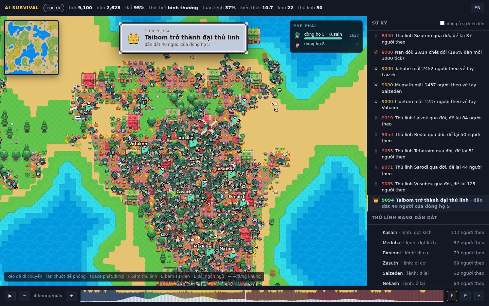
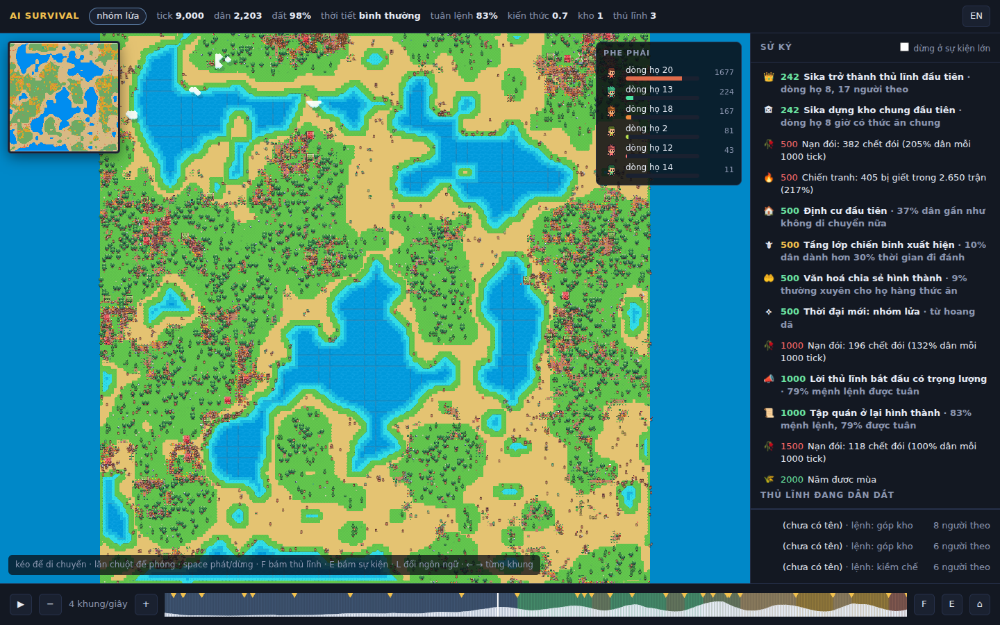

# AI Survival

Một thí nghiệm về sự sống nhân tạo. Thả hàng nghìn agent có não riêng vào một thế giới có luật vật lý
nhưng không có kịch bản, rồi xem chúng tìm ra cách sống nào: hái lượm, định cư, cướp bóc, chia sẻ,
đi theo thủ lĩnh, phát minh, hay khai thác đất tới cạn kiệt rồi diệt vong.

Không có gì bắt buộc phải giống lịch sử loài người. Thế giới có thể tuyệt chủng, sụp đổ, trì trệ,
hoặc thịnh vượng. Mỗi thế giới tự sinh ra công nghệ của riêng nó. Điều duy nhất được kiểm tra là:
xã hội có tìm được cách giữ mọi thứ phát triển mà không tự huỷ diệt hay không.

Repo này hiện chứa **lõi mô phỏng headless** (`sim/`). Chưa có đồ hoạ engine,
chỉ có xuất ảnh PPM, CSV, sử ký, và bảng kết cục khi chạy nhiều thế giới.

## Xem bằng mắt




```bash
cd sim && ./target/release/sim --seed 2 --ticks 20000 --snapshot-every 25 --out ../viewer/out
python3 ../viewer/serve.py            # rồi mở http://127.0.0.1:8765/index.html?seed=2
# thêm &live=1 để xem trong lúc sim đang chạy
```

`viewer/index.html` là game viewer 2D pixel art chạy trong trình duyệt bằng **PixiJS** (WebGL, đã kèm sẵn
trong `viewer/lib`, không cần mạng). Toàn bộ hình ảnh sinh bằng code lúc mở trang nên không vướng bản quyền:

- **Bản đồ** là tile 16x16 nhiều tông có viền: đất cằn nhất thành biển có sóng động, đất nghèo thành bờ cát,
  ba mức cỏ theo thức ăn có bụi cỏ và hoa, ruộng có luống và cây trồng lớn dần theo mức canh tác, mùa đông
  phủ tuyết và biển đóng băng. Bờ biển và mép cỏ được autotile theo bốn hướng nên đường bờ uốn lượn tự nhiên.
  Cây, thông, bụi, đá rải theo độ màu mỡ trên đất hoang. Làng có nhà tranh mái rơm, kho là nhà kho lớn mái đỏ.
- **Nhân vật** 16x24 có viền và bóng, bốn màu tóc, đai lưng, ủng; đi bộ bốn khung với tay vung, thở khi đứng,
  tư thế vung gậy khi đánh, mang giỏ khi hái, quay mặt theo hướng đi. Vị trí nội suy giữa hai khung chụp nên
  đi lại mượt dù chỉ chụp mỗi 25 tick. Người ốm da xanh có giọt mồ hôi, người đói mờ đi.
- **Minimap** góc trái với địa hình và chấm phe, bấm để bay tới. Tông màu đổi theo mùa và hạn hán, tuyết rơi
  mùa đông. Bản đồ chia 16 mảnh, chỉ mảnh có ô đổi mới được vẽ lại.
- **Phe phái** là dòng họ. Mỗi dòng họ có màu áo riêng từ bảng 24 màu và một hoạ tiết trên áo trong sáu mẫu,
  nên phân biệt được cả khi mù màu. Bảng phe phái bên phải hiện thị phần, thủ lĩnh và sprite mẫu, bấm để bay tới.
- **Thủ lĩnh** có cờ hiệu màu phe, to theo số người theo, kèm tên và biểu tượng mệnh lệnh đang ra.
- **Kho chung** là nhà kho gỗ mái đỏ với thanh đầy màu phe.
- **Sử ký song ngữ Việt Anh**, phím L để đổi. Sim ghi loại sự kiện, viewer dịch theo loại và có biểu tượng.
- **Sự kiện lớn** (đổi thời đại, thủ lĩnh đầu tiên, đại thủ lĩnh, dịch bệnh, kho đầu tiên, tập quán, sụp đổ,
  tuyệt chủng, đất chết, chiến binh, định cư, chia sẻ) hiện banner giữa màn hình và camera bay tới, có tuỳ chọn
  tự dừng. Chúng cũng được đánh dấu tam giác vàng trên thanh thời gian.
- Thanh thời gian tô màu thời đại và vẽ dân số. Phím F bám thủ lĩnh lớn nhất, E bám sự kiện, space phát,
  mũi tên đi từng khung, kéo thả ba file để xem không cần server.

Định dạng khung bản 3 ghi ở đầu `sim/src/snapshot.rs`: lớp đất lượng tử hoá, mã hoá delta và RLE với khung
khoá mỗi 16 khung, agent 22 byte có id để nội suy. 20.000 tick chụp mỗi 25 tick, đỉnh 4.000 agent, nặng 70 MB,
trong đó đất chỉ vài KB mỗi khung. Sim flush sau mỗi khung, `serve.py` hỗ trợ Range, nên `&live=1` bám được
run đang chạy.

### Chạy trên máy cá nhân

Đo trên máy ảo 4 nhân, không GPU: sim đạt khoảng 700.000 agent-tick mỗi giây, tức một thế giới 4.000 agent
chạy 175 tick mỗi giây, 20.000 tick trong 80 giây. Kết quả giống hệt từng byte dù bao nhiêu luồng. Viewer
vẽ vài nghìn sprite hoạt ảnh bằng WebGL, chạy tốt trên GPU tích hợp; ở đây kiểm tra bằng Chromium không đầu
với GL phần mềm. Tôi chưa chạy trên máy của bạn, nên hai điều cần xem: RAM của trình duyệt bằng cỡ file
ảnh chụp cộng vài chục MB, và với run trên 50.000 tick nên chụp thưa hơn hoặc xem trực tiếp.

## Chạy thử

```bash
cd sim
cargo build --release
./target/release/sim --seed 3 --ticks 30000 --image-every 5000   # một thế giới, xem trực tiếp
./target/release/sim --seeds 1-16 --ticks 30000                  # 16 thế giới song song, bảng kết cục
./target/release/sim --help
```

Một run kết thúc sớm nếu tuyệt chủng. Kết cục được phân loại: `extinct`, `collapsed` (dân số cuối dưới
một phần tư giai đoạn tốt nhất), `boom and bust` (dao động trên bốn lần ở cuối run), `fallen` (tụt thời đại),
`surviving`, `flourishing`, và biến thể `on dying land` khi đất đã cạn quá nửa.

Không phụ thuộc crate ngoài. Phần cảm nhận và tiếp xúc chạy song song trên mọi nhân bằng
`--threads N`, chia agent thành khối cố định 256 với RNG riêng từng khối, nên kết quả giống hệt
từng byte dù chạy bao nhiêu luồng. Một thế giới 20.000 tick với đỉnh 5.500 agent mất khoảng 50 giây
trên 4 nhân. Không còn trần dân số: đất là giới hạn duy nhất (`--max-agents 0`, mặc định).

Kết quả ghi vào `out/`:

- `stats_seed<N>.csv`: dân số, số dòng họ, Gini, số sinh, chết đói, bị giết, tấn công, chia sẻ, phân bố hành động, entropy chiến lược, theo từng cửa sổ thời gian.
- `frame_<tick>.ppm`: bản đồ. Xanh lá là thức ăn, đỏ là ruộng đang canh tác, chấm màu là agent với màu do gen quy định, trắng là đang ốm.
- `events_seed<N>.txt`: sử ký. Phát minh, dòng họ thống trị hoặc tuyệt chủng, nạn đói, chiến tranh, dịch bệnh, thiên tai, tầng lớp mới, thủ lĩnh, đổi thời đại, sụp đổ, đất cạn kiệt, tuyệt chủng.
- `experiment_A_B.csv`: bảng kết cục khi chạy `--seeds A-B`.

Cùng seed luôn cho cùng kết quả, nên có thể replay và so sánh thí nghiệm.

## Cách thế giới vận hành

**Thế giới** là lưới ô cuộn tròn. Mỗi ô có độ màu mỡ tiềm năng, sinh ra từ value noise
rồi ngưỡng hoá để đất tốt tụ thành từng vùng và khoảng 40% bản đồ gần như cằn cỗi.
Thức ăn mọc lại theo độ màu mỡ và theo mùa. Mùa đông giảm tốc độ mọc xuống 20%.

**Đất có thể chết.** Mỗi đơn vị thức ăn hái đi bào mòn độ màu mỡ một chút. Đất được nghỉ, còn nhiều
thức ăn, thì hồi phục chậm về tiềm năng. Đất cạn hẳn hồi phục cực chậm. Phát minh làm hái nhanh hơn
thường cũng làm đất mòn nhanh hơn. Đây là thứ để mất: xã hội thành công quá nhanh có thể tự huỷ diệt.

**Agent** có năng lượng, kho dự trữ, tuổi, dòng họ, kiến thức, và một bộ gen. Gen gồm trọng số
của một mạng thần kinh 24 input, 16 ẩn, 8 output (536 tham số) cộng một "màu" ba chiều.
Nhận diện họ hàng dựa trên khoảng cách màu.

**Mỗi tick**, agent nhìn thấy: năng lượng, tuổi, kho, thức ăn tại chỗ và gradient thức ăn,
agent gần nhất (hướng, khoảng cách, độ họ hàng, chênh lệch sức mạnh, kho của nó),
số hàng xóm là họ hàng và không họ hàng, mùa, mình vừa bị đánh hay chưa, mình biết công nghệ gì,
và ô đang đứng có phải ruộng không.
Não trả về hướng di chuyển, một cổng đi hay ở, và một trong năm hành động:

| Hành động | Tác dụng |
|---|---|
| gather | Lấy thức ăn từ ô đang đứng, dư thì cất vào kho |
| attack | Đánh agent gần nhất trong tầm. Ai khoẻ hơn dễ thắng. Thắng thì cướp kho và gây sát thương |
| share | Cho họ hàng gần nhất một phần kho |
| repro | Nếu đủ năng lượng, sinh con. Con thừa hưởng gen có đột biến |
| rest | Giảm tiêu hao năng lượng |

Không có hàm thưởng. Ai sinh được nhiều con thì gen của họ tồn tại. Đó là toàn bộ thuật toán học.
Diệt vong là thật: khi agent cuối cùng chết, run kết thúc. Cờ `--min-pop N` bật lại "nhập cư" nếu muốn.

## Cái gì có não, cái gì là luật

Mỗi agent có một bộ não riêng: mạng thần kinh hồi quy 53 input, 16 ẩn, 12 output, 876 trọng số,
kèm 9 gen tính khí. Mọi quyết định mỗi tick (đi đâu, ở hay đi, hái, đánh, chia sẻ, sinh, nghỉ,
ghi gì vào bộ nhớ) đều do não này đưa ra. Não được sinh ra từ não bố mẹ có đột biến, và trong đời
có thể tự thay đổi bằng cách bắt chước họ hàng thành công hơn. Không có kịch bản hành vi nào.

Phần viết tay là **luật thế giới**: thức ăn mọc thế nào, đánh nhau tính thắng thua ra sao, công nghệ
có tác dụng gì, thiên tai xảy ra thế nào, cảm xúc tăng giảm theo sự kiện nào. Đó là "harness". Não phải
tự tìm cách sống trong luật đó. Nông nghiệp, định cư, tầng lớp chiến binh, thủ lĩnh, chia sẻ đều là
thứ não tìm ra, không phải thứ được lập trình.

## Cảm xúc, suy nghĩ, may mắn

**Cảm xúc**: sợ, giận, vui, gắn bó, mỗi loại trong [0, 1]. Bị đánh thì sợ và giận, được chia sẻ thì vui và
gắn bó, no đủ thì vui, đói thì giận. Tốc độ nguôi và độ nhạy của từng cảm xúc là gen, nên tính khí tiến hoá.
Cảm xúc là input cho não và có tác dụng cơ học: sợ làm đánh yếu đi, giận làm đánh đau hơn, vui làm
dễ phát minh, gắn bó làm chia sẻ và dạy học nhiều hơn. Người theo thủ lĩnh bị lây cảm xúc của thủ lĩnh.

**Suy nghĩ**: bốn ô nhớ hồi quy não tự ghi mỗi tick và đọc lại tick sau, cộng trí nhớ về nhà là ruộng
đầu tiên mình canh tác.

**May mắn**: vận may cá nhân (tìm được kho), tai nạn, và mỗi năm thế giới đổ xúc xắc:
hạn hán, năm được mùa, mùa đông khắc nghiệt, dịch bệnh, lũ lụt, cháy rừng, vùng trù phú.
Dịch bệnh lây theo tiếp xúc, ăn nặng nhất ở làng đông người, miễn dịch sau khi khỏi rồi phai dần.

## Nhìn xa hơn ô đang đứng

Agent chỉ thấy ô dưới chân thì không thể phân biệt một mảnh đất mệt với một vùng đang chết, nên không
bao giờ rời đi kịp. Vì vậy thế giới có thêm **bản đồ vùng**: chia bản đồ thành ô vuông 12x12, mỗi 50 tick
tính lại độ khoẻ đất, lượng thức ăn và mật độ dân của từng vùng, rồi tính hướng tới vùng hứa hẹn nhất
trong 8 vùng lân cận. Não nhận sáu input: đất vùng này, thức ăn vùng này, mật độ vùng này, hướng x,
hướng y tới vùng tốt hơn, và mức chênh lệch. Chi phí gần như bằng không vì tính một lần cho cả thế giới.

## Mệnh lệnh của thủ lĩnh

Mỗi bộ não đều sinh ra một mệnh lệnh mỗi tick, nhưng nó chỉ tới tai ai đó nếu người này đang là thủ lĩnh.
Mệnh lệnh tới người theo chậm một tick, đúng như tin tức cần thời gian lan.

| Mệnh lệnh | Coi là tuân lệnh khi | Phần thưởng khi tuân |
|---|---|---|
| hold | đứng yên | chăm ruộng hiệu quả gấp 1,5 |
| move | đi cùng hướng được chỉ | chi phí di chuyển giảm 30% |
| raid | hành động là tấn công | sức đánh cộng thêm 12 |
| conserve | không hái lượm | nếu nghỉ thì tiêu hao giảm một nửa |
| pool | hành động là chia sẻ | cho đi nhiều hơn 1,5 lần |

**Không ai bị ép tuân lệnh.** Cùng một bộ não vừa chọn hành động vừa quyết định có theo lệnh hay không,
và nó nhìn thấy lệnh đó dưới dạng input. Tuân lệnh làm tăng gắn bó, cãi lệnh làm giảm gắn bó và làm
thủ lĩnh mất uy tín. Vì vậy thủ lĩnh ra lệnh sai sẽ mất người theo. Tỉ lệ tuân lệnh của cả xã hội là một
chỉ số được đo, và khi một loại lệnh chiếm quá nửa với tỉ lệ tuân trên 40% thì sử ký ghi nhận một **tập quán**
đã hình thành, ví dụ "tập quán ở lại" hay "tập quán kiềm chế".

## Tập quán: lệnh sống lâu hơn người ra lệnh

Một mệnh lệnh được tuân đi tuân lại sẽ thành **tập quán** của người tuân: agent giữ nó trong đầu với một
độ bền, và khi không có thủ lĩnh nào trong tầm nhìn thì tập quán lên tiếng thay, với đúng các phần thưởng
của mệnh lệnh đó. Tập quán lan giữa họ hàng như meme, người giữ chắc truyền cho người giữ lỏng. Cãi lại
tập quán của chính mình làm nó mòn, và nó phai dần theo thời gian nếu không được củng cố. Vì vậy một
xã hội có thể giữ thói quen kiềm chế hay ở lại sau khi thủ lĩnh đã chết. Sử ký ghi khi một tập quán được
trên 30% dân số giữ mà không cần thủ lĩnh.

## Xung đột giữa thủ lĩnh

Người theo so sánh thủ lĩnh hiện tại với ứng viên tốt nhất trong tầm nhìn, và chỉ đổi phe khi ứng viên hơn
một biên độ phụ thuộc gắn bó của chính họ, nên các băng không lật cùng lúc. Mỗi người **đào ngũ** làm
thủ lĩnh cũ mất uy tín và thủ lĩnh mới được một nửa số đó. Một thủ lĩnh có tên đi theo thủ lĩnh khác là
**sáp nhập**, kéo theo cả băng. Lệnh đột kích chỉ được coi là tuân khi đánh người ngoài dòng họ, nên
chiến tranh do thủ lĩnh phát động là chiến tranh giữa các nhóm, không phải nội chiến. Sử ký ghi các đợt
đổi phe trên 15 người và các băng trên 10 người sáp nhập.

## Bùng-vỡ và kiềm chế

Không có trần dân số nữa nên bùng-vỡ là kết cục tự nhiên: dân số bùng lên trong năm được mùa rồi chết
đói khi mùa đông tới. Chỉ số **breed** đo số ca sinh trên 1.000 lượt agent đủ năng lượng để sinh, và
**swing** đo dân số cao nhất chia thấp nhất ở phần ba cuối run. Câu hỏi để thí nghiệm là xã hội có tiến hoá
ra cách tự hãm sinh sản khi đông không, vì não nhìn thấy mật độ cả cục bộ lẫn theo vùng.

## Kho chung của làng

Thủ lĩnh có tên, đã định cư và có từ 10 người theo thì dựng một **kho chung** tại chỗ đứng, nếu quanh đó
chưa có kho của họ hàng. Người theo tuân lệnh "pool" bỏ thức ăn vào kho thay vì cho một người. Bất kỳ ai
cùng dòng họ đói mà không còn gì trong túi thì rút từ kho trong tầm 8 ô. Kẻ đột kích thắng trận cạnh kho
của dòng họ khác thì cướp kho. Kho hư hao 0,03% mỗi tick và bị quên khi trống lâu. Não thấy kho gần nhất:
có hay không, hướng, mức đầy. Sử ký ghi mỗi mùa đông mà số lần rút kho vượt dân số, tức là kho đã nuôi làng
qua mùa đông. Ở seed 2, kho đầu tiên dựng ở tick 790, và mùa đông tick 10.000 dân số 882 rút kho 3.055 lần.

## Học tập, rèn luyện, lãnh đạo

**Kỹ năng**: hái lượm, chiến đấu, canh tác tăng theo số lần làm, và học lỏm được từ họ hàng giỏi hơn
đứng cạnh. Không di truyền. Kỹ năng trung bình của xã hội tăng từ 0,25 lên 0,6 sau vài chục nghìn tick.

**Bắt chước**: gặp họ hàng giàu gấp rưỡi mình, não có xác suất nhỏ pha 10% trọng số về phía họ.
Gặp thủ lĩnh thì xác suất gấp ba. Đây là học trong đời, tắt bằng `--p-imitate 0` để so sánh.

**Thủ lĩnh**: uy tín tích luỹ từ con cái, phát minh, thắng trận, chia sẻ, và phai dần khi bị cãi lệnh. Sức hút là gen.
Mỗi agent theo họ hàng có uy tín nhân sức hút cao nhất trong tầm nhìn, và chỉ đổi thủ lĩnh khi có người
hơn hẳn 25%. Ai có từ 5 người theo là thủ lĩnh; giữ được 200 tick liên tục thì được đặt tên.
Thủ lĩnh dạy nhanh gấp đôi, người theo đánh mạnh hơn khi thủ lĩnh vừa ra trận, và cảm xúc lan từ
thủ lĩnh sang người theo. Cuối mỗi lần chạy có bảng vinh danh những người từng dẫn dắt đông nhất.

## Phát minh mở, không theo lịch sử loài người

Không có cây công nghệ viết sẵn. Mỗi thế giới tự sinh phát minh của riêng nó, tối đa 64 cái, từ hạt giống
của thế giới đó. Khi một agent đang làm việc, có xác suất nhỏ nó tìm ra một phát minh mới. Phát minh là
một bó hiệu ứng trên mười chiều:

| Chiều | Ý nghĩa |
|---|---|
| gather | hái nhanh hơn |
| metabolism | tiêu hao năng lượng (dương là tệ) |
| attack, defense | mạnh hơn khi đánh, khi giữ nhà |
| farm | chăm ruộng hiệu quả hơn |
| resist | chống bệnh |
| teach, invent, share | dạy nhanh hơn, phát minh nhanh hơn, cho nhiều hơn |
| soil | bào mòn đất thêm mỗi lần hái (dương là tệ) |

Lợi ích chính thiên về việc người phát minh đang làm: đang hái thì ra thứ về hái, đang đánh thì ra thứ
về đánh, đang ốm mà nghỉ thì ra thứ về chống bệnh, đang chia sẻ thì ra thứ về dạy học. Bậc phát minh
tăng theo số thứ người đó đã biết, nên lợi ích lớn dần. **Mọi phát minh đều có giá**: hoặc tiêu hao nhiều
hơn, hoặc bào mòn đất nhiều hơn. Phát minh về hái và ruộng thường trả giá bằng đất.

Kiến thức lan truyền theo tiếp xúc, họ hàng dạy dễ hơn, thủ lĩnh dạy gấp đôi, và bị quên khi thế hệ mới
không kịp học. Não nhìn thấy năng lực tổng của mình chứ không thấy tên phát minh.

**Thời đại** suy ra từ số phát minh trung bình mỗi đầu người và mức định cư, đặt tên không theo lịch sử:
wild, kindled, rooted, woven, layered, soaring, radiant, beyond. Sử ký ghi mỗi lần đổi thời đại,
sụp đổ (làng bị bỏ), lãng quên (kiến thức tụt quá nửa), đất cạn kiệt, và tuyệt chủng.

## Những gì đã quan sát được

Chạy 3 seed, cùng tham số mặc định, 20.000 tick:

| Seed | Kết cục | Tấn công / 2000 tick cuối | Chia sẻ | Ghi chú |
|---|---|---|---|---|
| 1 | Hai dòng họ lớn cùng tồn tại, hoà bình | 5.252 | 135 | Nghỉ ngơi 20% thời gian |
| 2 | Hai dòng họ lớn, hoà bình | 1.690 | 645 | Một dòng họ nghỉ 35% thời gian |
| 3 | Một dòng họ thống trị 89%, xã hội chiến tranh | 34.348 | 1.366 | Kho trung bình cao gấp 5 lần seed khác nhờ cướp |

Ở seed 3, số vụ tấn công tăng đều từ 20.000 lên 34.000 mỗi cửa sổ trong khi số chết đói
giảm từ 1.500 xuống 200. Cướp bóc trở thành cách sống chính khi nó hiệu quả hơn hái lượm.

Trong mọi seed, mùa đông đẩy tấn công và chết đói tăng vọt, đúng với dự đoán rằng xung đột
nảy sinh từ khan hiếm chứ không cần thưởng cho việc đánh nhau.

Phân cụm chiến lược ở tick 20.000 cho thấy phân hoá **bên trong** xã hội:

| Seed | Cách sống hiệu dụng | Các cụm đáng chú ý |
|---|---|---|
| 3 | 3.3 | 59% hái lượm thuần; 11% hái lượm kiêm cướp (attack 19%); 6% cướp là chính (attack 38%); 1.6% chiến binh (attack 65%). Tất cả trong cùng 2 dòng họ. |
| 1 | 5.3 | 58% hái lượm; 30% hái lượm xen nghỉ; 10% nghỉ là chính (rest 60%), nghèo hơn hẳn (của cải 40 so với 80). |
| 2 | 3.9 | 57% hái lượm; một cụm 7% "sinh sản là chính" (repro 35%); một cụm 7% chuyên chia sẻ với họ hàng. |

Trước khi có lớp văn hoá, chưa seed nào định cư: mọi cụm đều di chuyển trên 45% tốc độ tối đa.

### Cách mạng nông nghiệp

Với lớp văn hoá, 40.000 tick, tham số mặc định:

| Seed | farming khám phá | Định cư bắt đầu | Tick 40.000 |
|---|---|---|---|
| 3 | tick 9.596 | tick 30.000, 40% dân số ở yên | 80% ở yên, 8.700 ô ruộng, tấn công giảm từ 70.000 xuống 4.800 mỗi cửa sổ, chia sẻ tăng từ 5.000 lên 138.000 |
| 1 | tick 4.369 | tick 10.000, 32% dân số ở yên | 63% ở yên, 8.500 ô ruộng, dân số chạm trần 4.000 |

Không ai bảo agent phải định cư. Nông nghiệp chỉ làm cho ở yên trở nên có lợi, và tiến hoá tìm ra
việc đó sau vài nghìn tick. Khi làng xuất hiện thì bạo lực giảm, chia sẻ tăng, và các cụm chiến lược
mới xuất hiện: "sinh sản là chính" (repro 90%) và "chia sẻ là chính" (share 70%), là những kiểu sống
không tồn tại nổi thời du mục. Ảnh cuối seed 3 cho thấy các ô ruộng đỏ tụ thành làng trên đất tốt,
du mục còn lại lang thang ở vùng cằn giữa các làng.

### Ba lịch sử khác nhau từ cùng một luật

60.000 tick, tham số mặc định, trước khi có thủ lĩnh:

| Seed | Lịch sử |
|---|---|
| 3 | Đủ mọi thời đại theo đúng thứ tự: Stone Age, Dawn of Farming ở tick 5.000, Village Age 10.000, Metal Age 15.000, Age of Writing 25.000. Ruộng bị đốt lần đầu ở tick 10.183. Vui trung bình tăng từ 0,08 lên 0,65 khi xã hội thịnh vượng. |
| 1 | Kẹt ở Village Age suốt 50.000 tick. Xã hội này không chịu nghỉ nên không có nấu ăn, không nấu ăn thì không có kim loại. Gắn bó bằng 0 nên không có chữ viết. |
| 2 | Sụp xuống 1.000 dân ở Stone Age vì mùa đông, rồi sau khi có nông nghiệp thì đi từ Village Age tới Age of Writing chỉ trong 5.000 tick. |

Với thủ lĩnh, seed 3 sau 30.000 tick: thủ lĩnh có tên đầu tiên ở tick 219 với 6 người theo. Đại thủ lĩnh
chỉ xuất hiện sau tick 20.000 khi làng đủ đông. Tarel của dòng họ 16 kết thúc với 255 người theo.

### Thí nghiệm 8 thế giới với phát minh mở

Cùng luật, 40.000 tick, không nhập cư, đất có thể chết:

| Lần | Thay đổi | Kết cục |
|---|---|---|
| 1 | Chăm ruộng không trả lại gì cho đất | 8/8 sụp đổ. Đất còn 5% đến 47%. Seed 6 biết đủ 64 phát minh, mỗi người thuộc 43 cái, nhưng đất còn 12% và làng bị bỏ hoang. |
| 2 | Chăm ruộng phục hồi đất mạnh, thêm phát minh bảo tồn đất | 7/8 thịnh vượng, đất 98% đến 100% ở mọi thế giới. Quá dễ. |
| 3 | Phục hồi yếu đi năm lần | Phân tán: đất từ 52% đến 100%. Seed 7 tụt đất từ 100% xuống 55% cùng các đợt dịch. Seed 1 quên kiến thức từ 40 xuống 14 phát minh mỗi đầu người khi dòng họ thống trị tuyệt chủng. |

Bài học: chỉ khi có cả hai con đường, khai thác và bảo tồn, mà không con đường nào rẻ hơn hẳn,
thì các thế giới mới rẽ nhánh. Đó là điều kiện để thí nghiệm có nghĩa.

### Không trần dân số, có thủ lĩnh, tập quán và bản đồ vùng

8 thế giới, 30.000 tick, tham số mặc định:

| Seed | Kết cục | Đỉnh dân | Đất | Tuân lệnh | Lệnh chính | Tập quán | Sinh/1000 | Dao động |
|---|---|---|---|---|---|---|---|---|
| 1 | thịnh vượng | 2.583 | 88% | 7% | move | | 4,7 | 1,2 |
| 2 | thịnh vượng | 3.246 | 87% | 76% | hold | hold 20% | 9,1 | 2,1 |
| 3 | thịnh vượng trên đất chết | 4.495 | 45% | 1% | không có thủ lĩnh | | 5,2 | 3,9 |
| 4 | thịnh vượng | 4.786 | 97% | 8% | move | | 5,9 | 3,9 |
| 5 | thịnh vượng trên đất chết | 5.815 | 44% | 48% | hold 100% | hold 9% | 7,8 | 1,8 |
| 6 | thịnh vượng | 5.833 | 90% | 4% | move | | 6,0 | 2,3 |
| 7 | bùng-vỡ | 5.602 | 100% | 47% | | | 13,6 | 9,2 |
| 8 | thịnh vượng | 10.015 | 96% | 21% | raid | | 10,7 | 3,2 |

Đọc được gì:

- **Đất giới hạn được dân số** mà không cần trần: đỉnh chênh nhau bốn lần giữa các thế giới.
- **Thế giới sinh nhiều nhất là thế giới bùng-vỡ** (13,6 ca trên 1.000 lượt, dao động 9 lần) và thế giới sinh ít nhất
  là thế giới ổn định nhất (4,7 và dao động 1,2). Ở giữa thì nhiễu. Chưa đủ để kết luận có kiềm chế tiến hoá,
  nhưng đúng hướng để đo tiếp với nhiều seed hơn.
- **Hai thế giới làm chết đất theo hai cách ngược nhau**: seed 3 không có thủ lĩnh, ai cũng lang thang và vét;
  seed 5 tuân lệnh "ở lại" tuyệt đối và cày chết chính mảnh đất mình đứng. Vâng lời không phải là cứu cánh,
  vâng lời đúng lệnh mới là.
- **Tập quán hình thành** ở seed 2 và 5 (20% và 9% giữ thói quen ở lại không cần thủ lĩnh) nhưng chưa vượt
  30% dân số trong 30.000 tick.
- Seed 7 giữ đất 100% mà vẫn bùng-vỡ: sụp không phải vì đất mà vì mùa đông và dịch đúng lúc dân đông.
  Kho chung là bước tiếp theo hợp lý.

### Đối chứng: có mệnh lệnh và không có mệnh lệnh

Cùng 12 seed, 30.000 tick, một nhánh mặc định, một nhánh `--no-orders` (thủ lĩnh vẫn hình thành
nhưng lệnh không tới ai). Mọi thứ khác giữ nguyên.

| | Có lệnh | Không lệnh |
|---|---|---|
| Đất còn lại (trung vị) | 87% | 66% |
| Dân số cuối (trung vị) | 1.060 | 859 |
| Đỉnh dân số (trung vị) | 5.194 | 6.522 |
| Dao động cuối run (trung vị) | 2,6 lần | 3,3 lần |
| Kết cục xấu (sụp, bùng-vỡ, đất chết) | 3 / 12 | 5 / 12 |
| Kiến thức mỗi đầu người (trung vị) | 12,4 | 12,4 |

So theo từng seed: nhánh có lệnh giữ đất tốt hơn ở 9 trên 12 thế giới và dân số cuối cao hơn ở 8 trên 12.

Cách đọc: thủ lĩnh không làm xã hội **lớn** hơn, đỉnh dân số còn thấp hơn. Thủ lĩnh làm xã hội **bền** hơn:
đất còn nhiều hơn, dao động nhỏ hơn, ít sụp hơn. Tức là mệnh lệnh đang hoạt động như một cái phanh
tập thể, kìm bùng nổ để tránh vỡ. Kiến thức không đổi, nên hiệu ứng không đến từ dạy học nhanh hơn
mà từ phối hợp hành vi. Tỉ lệ tuân lệnh trung bình vẫn thấp, phần lớn dưới 10%, nên chỉ một thiểu số
nghe lời đã đủ tạo khác biệt. Mẫu 12 còn nhỏ, chưa phải kết luận thống kê, nhưng chiều hướng nhất quán.

### Ba bài học khi cân bằng

1. Xác suất khám phá phải tính theo agent-tick. 1000 agent với xác suất 0,0002 mỗi tick tìm ra công cụ ngay tick 1.
2. Nếu đi ngang qua cũng chăm được ruộng thì 4000 du mục biến cả bản đồ thành ruộng mà không ai cần ở lại.
3. "Đứng yên" phải là một quyết định dễ đột biến. Với hai output tanh bão hoà, đứng yên là điểm có xác suất
   gần bằng không và tiến hoá không bao giờ tới. Tách thành một output đi hay ở theo dấu là đủ.

## Cấu trúc mã

```
sim/src/
  config.rs   toàn bộ luật thế giới và tham số, đọc từ CLI
  world.rs    sinh địa hình, thức ăn, mùa
  brain.rs    gen, mạng thần kinh, đột biến, độ họ hàng
  agent.rs    trạng thái agent và quyết định mỗi tick
  spatial.rs  spatial hash cho truy vấn hàng xóm O(k)
  sim.rs      vòng lặp: mọc lại, cảm nhận, nghĩ, hành động, chết, nhập cư
  stats.rs    thống kê cửa sổ, entropy hành động, Gini, CSV
  strategy.rs phân cụm hành vi k-means, gộp cụm, entropy chiến lược
  events.rs   sử ký: khám phá, thống trị, tuyệt chủng, nạn đói, chiến tranh, tầng lớp mới, thời đại, thủ lĩnh
  render.rs   xuất PPM
  rng.rs      xorshift64* có seed
```

## Bước tiếp theo

1. Tốc độ sim: cấu trúc agent quá lớn gây trượt cache khi quét hàng xóm; chuyển sang mảng gọn theo cột.
2. Viewer: hiệu ứng cho trận đánh, dịch, thiên tai; âm thanh; chọn một agent để theo dõi cả đời.
3. Đóng gói thành ứng dụng chạy một cú bấm (Tauri hoặc Electron) gồm sim và viewer.
