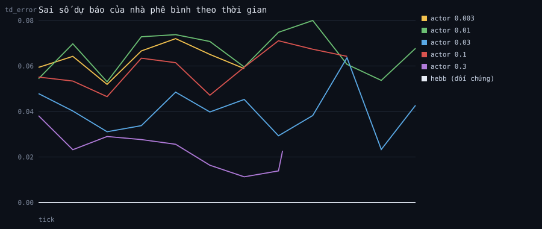

# Quét siêu tham số cho bộ não học bằng gradient

3 thế giới mỗi cấu hình, 6,000 tick. Chỉ một siêu tham số thay đổi; phần còn lại giữ nguyên.

| cấu hình | dân cuối | kiến thức | phát minh | sai số dự báo (nửa sau) |
|---|---|---|---|---|
| actor 0.003 | 937 | 24.8 | 50 | 0.072 |
| actor 0.01 | 718 | 16.9 | 36 | 0.067 |
| actor 0.03 | 17 | 2.6 | 15 | 0.039 |
| actor 0.1 | 617 | 5.8 | 23 | 0.065 |
| actor 0.3 | 1 | 0.0 | 13 | 0.011 |
| hebb (đối chứng) | 156 | 2.4 | 23 | – (không có nhà phê bình) |

## Kết quả lần chạy này

Cấu hình **đoán giỏi nhất** là `actor 0.3`, sai số 0.011, và nó kết thúc với
1 người và 0.0 thứ mỗi người biết.
Cấu hình **sống tốt nhất** là `actor 0.003`, sai số 0.072, kết thúc với
937 người và 24.8 thứ mỗi người biết.

Hai cấu hình đó **không phải một**. Chọn theo hàm mất mát là chọn sai.

## Đọc bảng này thế nào

Cột cuối là thứ một người mới học hay bám vào: sai số dự báo càng nhỏ càng tốt. Ba cột trước
là thứ thật sự quan trọng. Nếu cấu hình có sai số nhỏ nhất lại không phải cấu hình cho xã hội
khá nhất, thì bạn vừa gặp bài học trung tâm của máy học ứng dụng: **hàm mất mát không phải mục
tiêu, nó chỉ là thứ đo được**. Chọn mô hình theo hàm mất mát mà không nhìn kết quả thật là cách
hỏng việc phổ biến nhất trong ngành.

_Sinh bởi `python3 tools/learning.py`._
